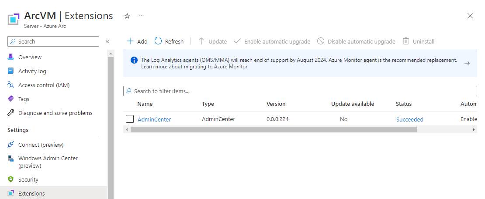
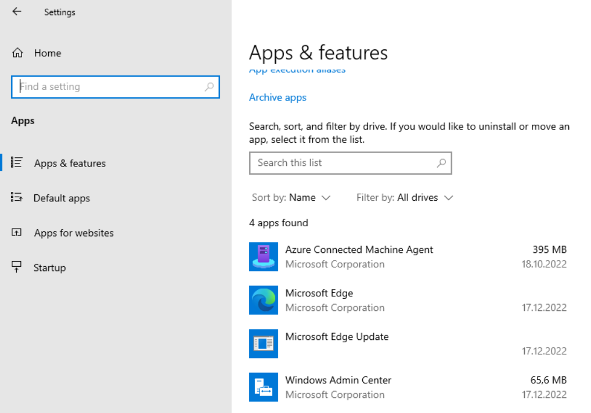
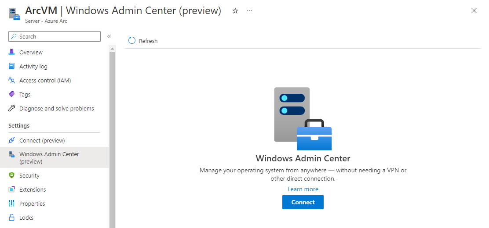
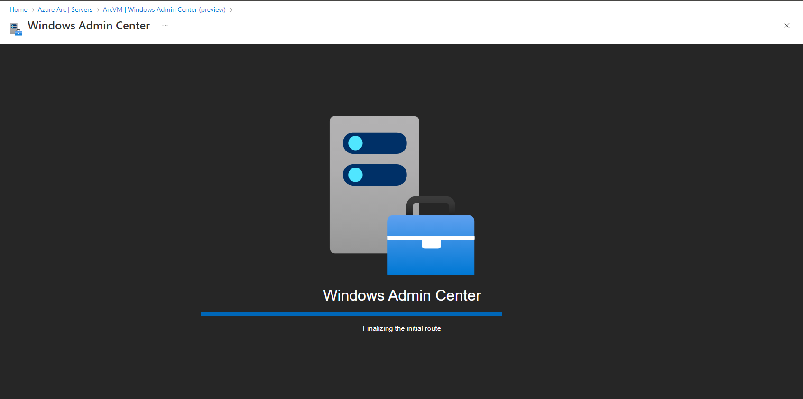
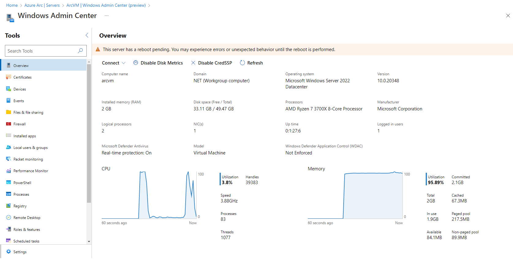

In this blog post i will show you how you can install Windows Admin Center on an Arc enabled Server.

## What is Windows Admin Center?

With Windows Admin Center you are able to control your Clients and Servers with a web based interface.
For Azure Arc enabled Servers this is in preview at the time when I write this article.

For example you can access the following services on your Server or Client:

- Explorer
- PowerShell
- Registry
- Device Manager
- Remote Desktop
- and so on

If you want to read more please click [here](https://learn.microsoft.com/en-us/windows-server/manage/windows-admin-center/overview){:target="_blank"}
If you want to read more about the requirements of Windows Admin Center for Arc-enabled Server please click [here](https://learn.microsoft.com/en-us/windows-server/manage/windows-admin-center/azure/manage-arc-hybrid-machines){:target="_blank"}

## Install Windows Admin Center

<blockquote class="prompt-tip">
    Please authenticate to your Subscription first.
</blockquote>

To install Windows Admin Center we first need a view variables

```powershell
$location = 'West Europe' # Your Azure location where your Azure Arc resource is deployed to
$machineName = 'ArcVM' # The name of you Azure Ard resource that you see in your Azure Portal
$resourceGroup = 'ArcResources' # The resource group where the Azure Arc resource is located
$subscription = 'xxx' # Your Subscription id
$port = '6516' # The standard port of Windows Admin Center
```

Windows Admin Center will be installed through an Azure extension.
You can install it with the following PowerShell code:

```powershell
$Setting = @{ 'port' = $port }
$Parameters = @{
    Name              = 'AdminCenter'
    ResourceGroupName = $resourceGroup
    MachineName       = $machineName
    Location          = $location
    Publisher         = 'Microsoft.AdminCenter'
    Settings          = $Setting
    ExtensionType     = 'AdminCenter'
    SubscriptionId    = $subscription
}
New-AzConnectedMachineExtension @Parameters

#Allow connectivity
$putPayload = "{'properties': {'type': 'default'}}"
$Parameters = @{
    Method  = 'PUT'
    Uri     = "https://management.azure.com/subscriptions/${subscription}/resourceGroups/${resourceGroup}/providers/Microsoft.HybridCompute/machines/${machineName}/providers/Microsoft.HybridConnectivity/endpoints/default?api-version=2021-10-06-preview"
    Payload = $putPayload
}
Invoke-AzRestMethod @Parameters
```

In the Azure Portal you should see an Extension on your Arc Enabled Server



If you check your installed Software on your Virtual Machine you should see Windows Admin Center



## Assign Role Assignments to access Windows Admin Center

To access Windows Admin Center through the Azure Portal you need the following Azure permissions:

- Windows Admin Center Administrator Login
- Reader

Assign the 'Windows Admin Center Administrator Login' role to a group or a user

<blockquote class="prompt-tip">
    you can also use the objectid of an Azure AD Group. You can retrieve this with Get-AzADGroup
</blockquote>

```powershell
$user = Get-AzAdUser -UserPrincipalName 'username'
$UserId = $User.Id

$splat = @{
    RoleDefinitionName = 'Windows Admin Center Administrator Login'
    ObjectId           = $UserId
    ResourceGroupName  = 'ArcResources-rg'
    ResourceName       = 'ArcVM'
    ResourceType       = 'Microsoft.HybridCompute/machines'
}
New-AzRoleAssignment @splat

$splat = @{
    RoleDefinitionName = 'Reader'
    ObjectId           = $UserId
    ResourceGroupName  = 'ArcResources-rg'
    ResourceName       = 'ArcVM'
    ResourceType       = 'Microsoft.HybridCompute/machines'
}
New-AzRoleAssignment @splat
```

You can check if everything worked if you click On Access Control (IAM) on your Azure Arc
enabled server.

You should be able to access Windows Admin Center (preview) now through the Azure Portal







That's it for today. Happy Windows Admin Center enrolling.