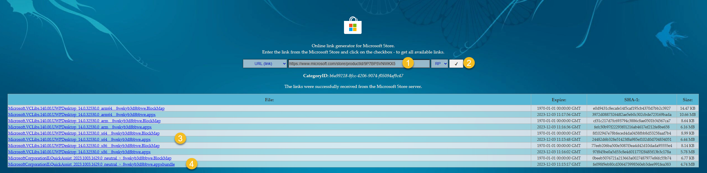
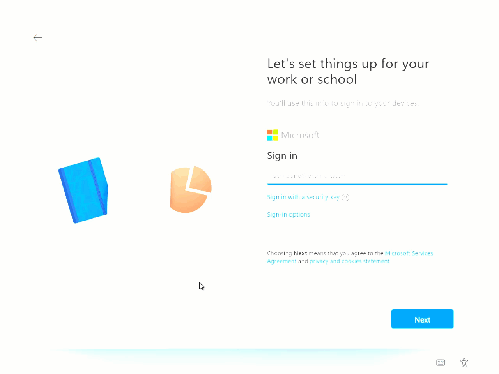
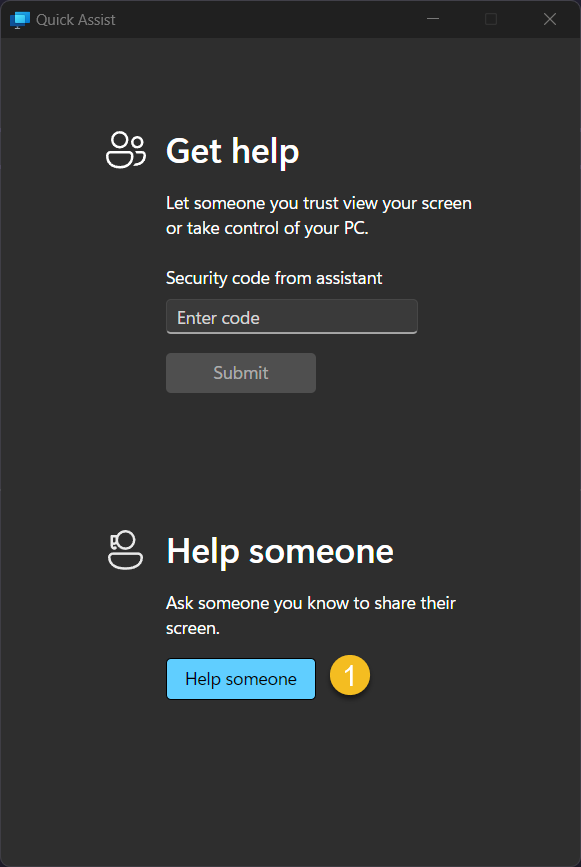
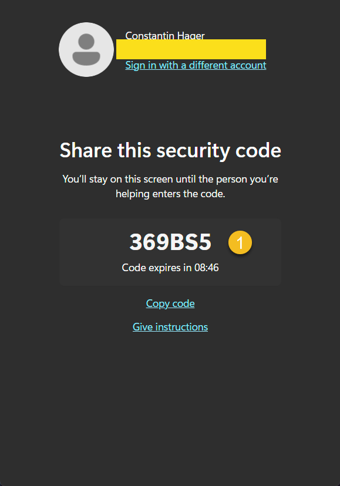
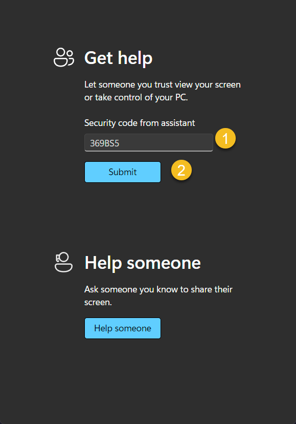
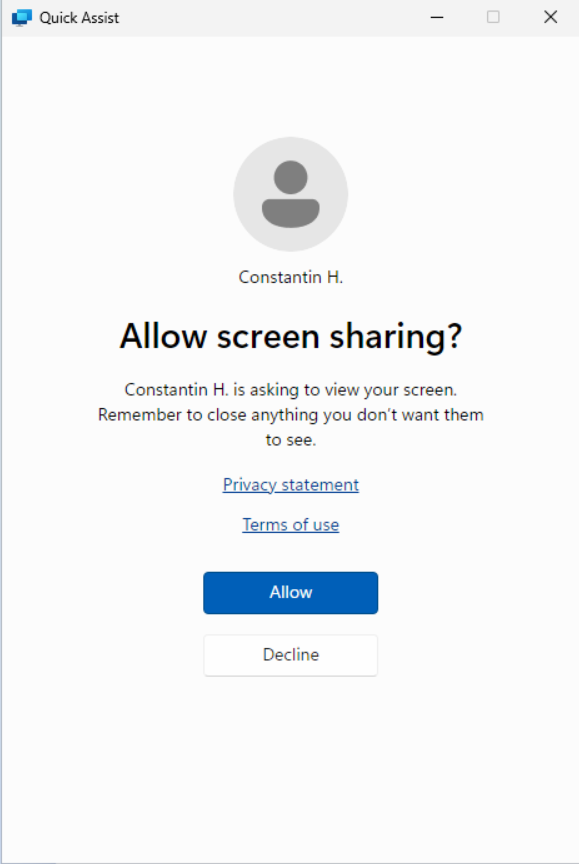
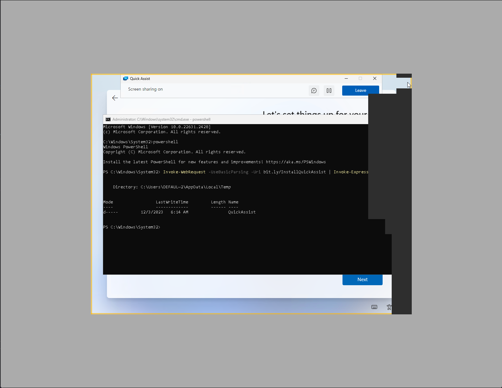
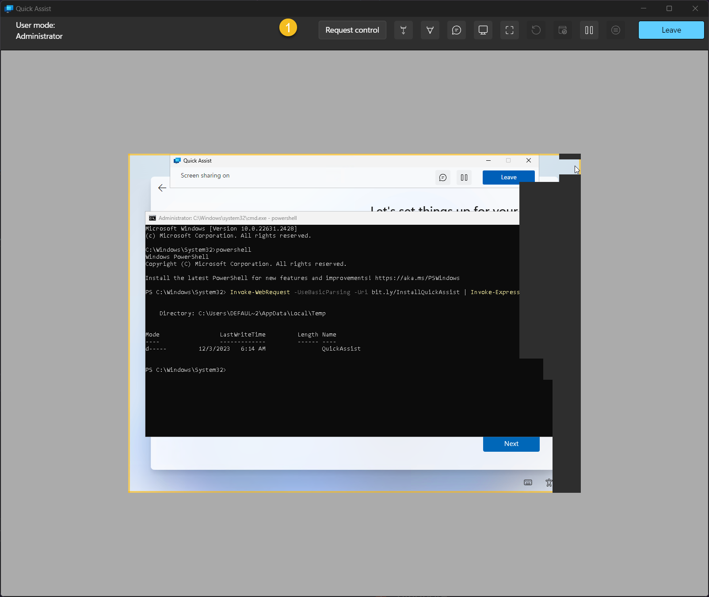
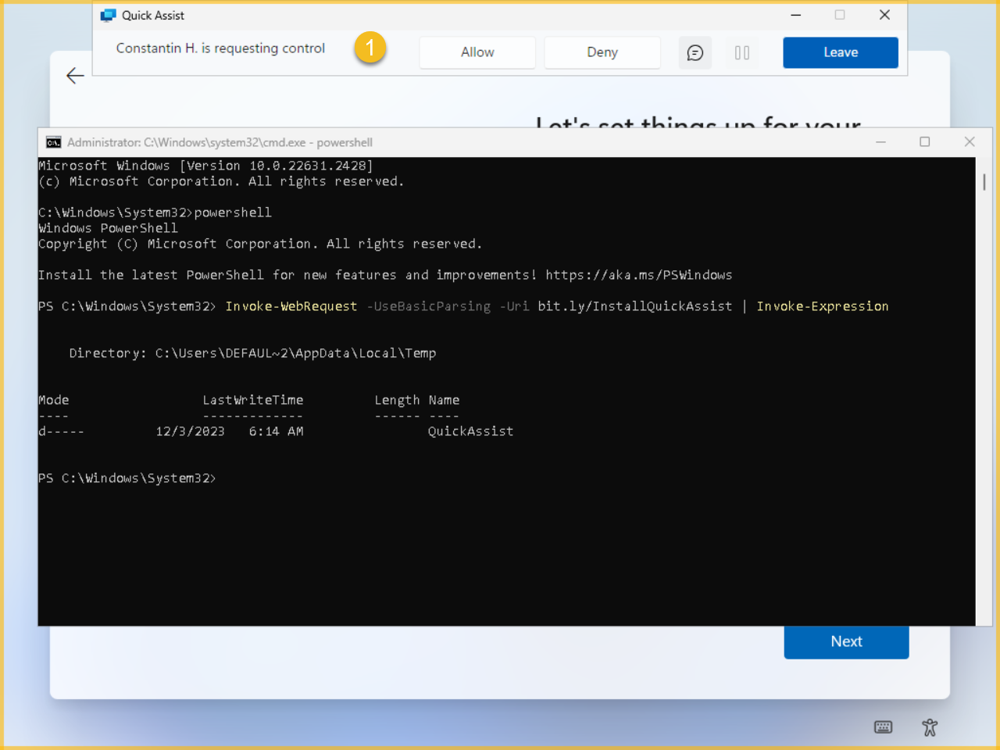

In this blog post, I'll outline the steps for installing Quick Assist within the Out-of-Box Experience (OOBE).

## What is Quick Assist?

Quick Assist is a Microsoft Store application that enables a person to share their device with another person
over a remote connection.

Your support staff can use it to remotely connect to a user’s device and then view its display,
make annotations, or take full control.

It is a useful tool for troubleshooting, diagnosing technological issues, and providing instructions to users
directly on their devices.

All that’s required to use Quick Assist is suitable network and internet connectivity.

If you want to learn more click [Here](https://learn.microsoft.com/en-us/windows/client-management/client-tools/quick-assist){:target="_blank"}.

## Get the current QuickAssist install files

Quick Assist comes preinstalled on Windows 10 and Windows 11 machines by default, but the installed version is outdated and not suitable for use.

To obtain the latest artifacts from the Microsoft Store, visit [this](https://store.rg-adguard.net/){:target="_blank"} page
and input the link "https://www.microsoft.com/store/productId/9P7BP5VNWKX5".



Download the following files:
- MicrosoftCorporationII.QuickAssist_2023.1003.1629.0_neutral_~_8wekyb3d8bbwe.appxbundle
- Microsoft.VCLibs.140.00.UWPDesktop_14.0.32530.0_x64__8wekyb3d8bbwe.appx

Upload them in a location accessible to everyone for download, such as on GitHub, Azure Blob Storage or OneDrive.

## Prepare the QuickAssist download script

```powershell
if (Test-Path -Path "$env:TEMP\QuickAssist") { Remove-Item -Path "$env:TEMP\QuickAssist" -Recurse -Force }
New-Item -Path "$env:TEMP\QuickAssist" -ItemType Directory -Force

$splat = @{
    Uri     = 'https://bit.ly/DownloadQuickAssistBundle'
    OutFile = "$env:TEMP\QuickAssist\QuickAssist.AppxBundle"
}
Invoke-WebRequest @splat

$splat = @{
    Uri     = 'https://bit.ly/DownloadVCLibs'
    OutFile = "$env:TEMP\QuickAssist\VCLibs.Appx"
}
Invoke-WebRequest @splat

Add-AppPackage -Path "$env:TEMP\QuickAssist\VCLibs.Appx"
Add-AppxPackage -Path "$env:TEMP\QuickAssist\QuickAssist.AppxBundle"
$Package = Get-AppxPackage -Name 'MicrosoftCorporationII.QuickAssist'
Start-Process 'explorer.exe' -ArgumentList "shell:AppsFolder\$($Package.PackageFamilyName)!App"
```

Save this script and place it in a location accessible to everyone for download, such as on GitHub, Azure Blob Storage or OneDrive.
To streamline the script download and creation process for both users and yourself, think about utilizing a link shortener like [Bitly](https://bitly.com/).

The user simply uses SHIFT + (FN) + F10 to launch the command prompt and enter:

```powershell
powershell
Invoke-WebRequest -Uri <your bitly link> | Invoke-Expression
```



## Assist the end user

Execute Quick Assist on your end and click on "Help Someone"



Sign in with a Microsoft account to receive a code that you can then share with the end user.



The user inputs the code and clicks "Submit."



The user can recognize the connecting individual and choose to click "Allow."



The supporter receives a wait screen


If the connection is established



To gain control of the end user's device, the supporter can click on "Request Control."



The end user will receive a request to authorize the supporter's full control and give consent.



Click on "Leave" to end the support session.

<blockquote class="prompt-tip">
    A script with similar functionality is available on the PowerShell Gallery (Invoke-Quickassist).
    At the time of writing this blog post it only works reliably on Windows 10 but not on Windows 11.
</blockquote>

That's It. Thank you for reading.
