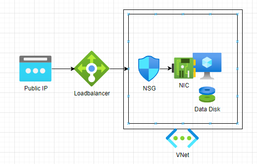

This is the first blog post of a series, that guides you through the steps of setting up an nested virtualization Azure virtual machine.
We'll start by planning and explaining the infrastructure.

## What is nested virtualization?

Nested virtualization is a functionality that enables the operation of a hypervisor within a virtual machine.

If we refer to an image from the [Microsoft Learn](https://learn.microsoft.com/en-us/virtualization/hyper-v-on-windows/user-guide/nested-virtualization){:target="_blank"}
article on nested virtualization we can better visualize the concept.

I leverage nested virtualization primarily for constructing lab environments, especially when physical hardware is unavailable in my home.

## Which Azure machine sizes are compatible with nested virtualization?

- D_v3
- Ds_v3
- Dv4
- Dsv4

and so on. The full list is documented [here](https://learn.microsoft.com/en-us/azure/virtual-machines/acu){:target="_blank"}.

## The Infrastructure

This is the infrastructure that we are going to build in this series.

We will detail each component of this infrastructure.

### Public Ip

To establish a connection to our environment, a static public IP address in the standard SKU is required.

### Virtual Network and Subnet

An Azure Virtual Network (VNet) is a fundamental building block in Microsoft Azure,
providing a logically isolated and securely connected network in the cloud.

In this scenario, we create the IPv4 address range 172.16.0.0/16. Within the Azure Virtual Network,
we set up a subnet named nestedvm-snet, starting at the address 172.16.0.0.
The subnet is configured with a size of /24, providing a total of 256 addresses.

### Loadbalancer

We will use a standard Azure public loadbalancer.

We will generate the following NAT rules:

| Direction| Port                  | Destination     |
|----------|-------                |-------          |
| Outbound | Internet              | Virtual Machine |
| Inbound  | 61412 (RDP High Port) | Virtual Machine |

<blockquote class="prompt-tip">
    By default, standard load balancers and standard public IP addresses block inbound connections
    unless explicitly allowed by Network Security Groups (NSGs).
    An Azure standard Loadbalancer is not open to the internet by default.
</blockquote>

### Network Security Group (NSG)

In order to enable Remote Desktop Protocol (RDP) access to our Azure Virtual Machine,
it is necessary to permit traffic originating from the Load Balancer's high port NAT Rule
and direct it to the standard RDP port 3389.

### Virtual Machine

In the context of my setup, I've chosen the Azure Virtual Machine Size Standard_D4s_v4, which provides 4 cores and 16 GB of RAM.
To optimize costs, I've used an Azure Spot instance.

<blockquote class="prompt-tip">
    Azure Spot Instances allow users to take advantage of unused Azure compute capacity at a significantly lower cost
    compared to regular (on-demand) virtual machines. However, it's essential to note that the availability of Spot
    Instances is subject to Azure's surplus capacity.
</blockquote>

The virtual machine's storage utilizes a 1 TB Standard HDD Managed disk.

## Cost Breakdown

| Resource           | Type            | Price  | Comment                                                          |
|--------------------|-----------------|------- | ---------------------------------------------------------------- |
| Public IP Address  | Standard        | 3.32 € |                                                                  |
| Virtual Network    | -               | 0.00 € |                                                                  |
| Load Balancer      | External        | 4.55 € | 1TB traffic per month included.                                  |
| Virtual Machine    | Standard_D4s_v4 |27.55 € | A Spot VM is used. The normal price would is 275.22 €            |
| Standard HDD       | 1 TB            |37.30 € |                                                                  |
|--------------------| ----------------|------- | ---------------------------------
------------------------------- |
| Price per Month    |                 |72.72 € |                                                                  |

Part 1 wraps up at this point. Moving on to Part 2, we set up GitHub to facilitate the deployment of our infrastructure on Microsoft Azure.
