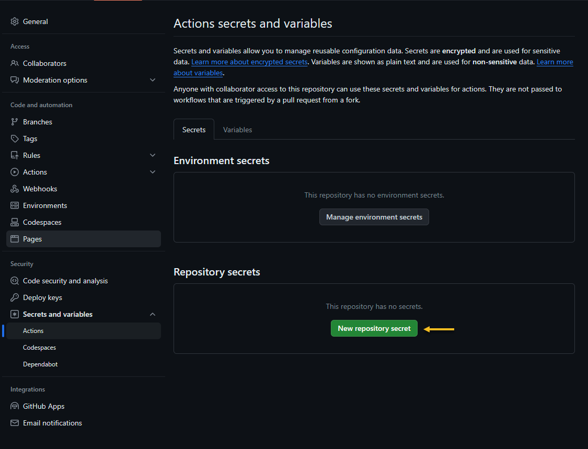

Series Table of contents:

- [Part 1: Infrastructure planning]()

Happy new year everybody. We continue our journey of building a nested virtual machine in Azure.
In the following article, I will discuss two key aspects:

- Create a GitHub repository
- Create an Azure Service Principal and establish a connection with our previously created GitHub repository.

## Create an Azure Service Principal

Within the Entra ID portal, go to App registration and select "New registration".

On the following screen, make a record of the specified values:
- Application (client) ID
- Directory (tenant) ID

## Create a GitHub repository

If you don't have a GitHub account create one. Create a new repository.

### Create secrets for GitHub Actions

Navigate to Settings -> Secrets an variables -> Actions and create the following Repository secrets:

- AZURE_CLIENT_ID: See Application (client) ID
- AZURE_SUBSCRIPTION_ID: In the Azure Portal search for the "Subscription" Service and find the subscription id
next to the "Subscription name"
- AZURE_TENANT_ID: See Directory (tenant) ID
- STORAGE_ACCOUNT: The name of the Terraform Storage Account
- CONTAINER_NAME: The name of the Terraform Storage Account Container
- RESOURCE_GROUP_NAME: The resource group of the Terraform Storage Account

Click on "Add secret". Repeat the process for the other 2 repository secrets.

End result:

## Add Federated credentials to the App registration

Within your recently generated service principal, go to "Certificates & secrets" and choose "Federated Credentials".

Click on "Add credential"

## Federated credential for main branch

"Federated credential scenario: "GitHub Actions deploying Azure Resources"

1. Organization: Provide either your GitHub account name or, if the repository is located within a GitHub organization,
specify the organization's name.
2. Repository: The name of the GitHub repository.
3. Entity Type: Branch
4. Based on selection: "main" or your branch name.
5. Name: Provide a meaningful name.

Click on "Add"

## Federated credential for pull request

Click on "Add credential"

"Federated credential scenario: "GitHub Actions deploying Azure Resources"

1. Organization: Provide either your GitHub account name or, if the repository is located within a GitHub organization,
specify the organization's name.
2. Repository: The name of the GitHub repository.
3. Entity Type: Pull request
4. Name: Provide a meaningful name.

Click on "Add"

End result

If you prefer to watch a YouTube video demonstrating the setup and additional steps, you can do so.

<iframe width="800" height="600" src="https://www.youtube.com/embed/10ljwwJ3V30" title="Using OIDC with GitHub Actions and Terraform" frameborder="0" allow="accelerometer; autoplay; clipboard-write; encrypted-media; gyroscope; picture-in-picture; web-share" allowfullscreen></iframe>

## Assign Permissions

The previously generated service principal requires permissions for deploying Azure resources.
I will assign Contributor permissions at the Azure Subscription level.

Within the Azure Portal, go to the "Subscription" service, choose your subscription, and click on "Access control (IAM)".

Select "Add" -> "Add role assignment"

Select "Privileged administrator roles" and select "Contributor". Click "Next".

Choose "Select members," search for the name of the previously generated service principal, and select it.
Click on "Select".

Select "Review + assign"

Select "Review + assign"

Result:

That's it for part 2 in part 3 we create the GitHub workflows for the terraform deployment.
