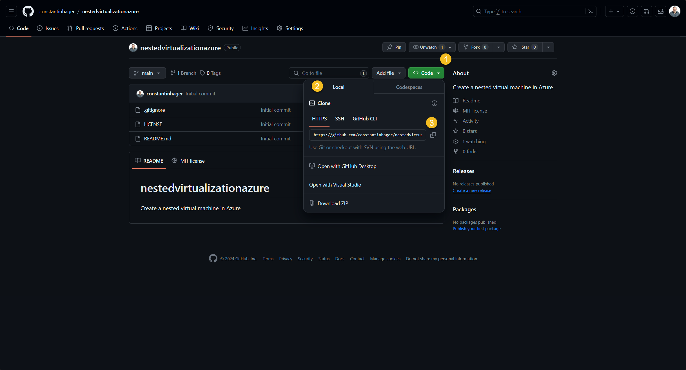
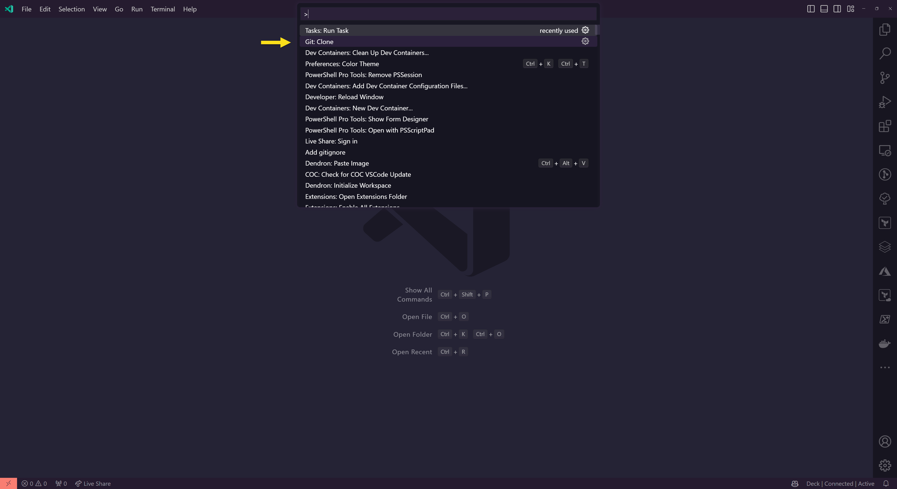
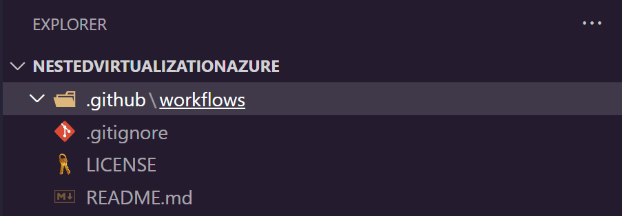
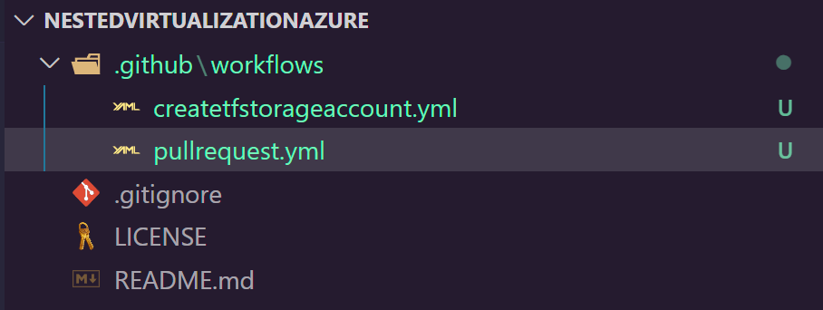
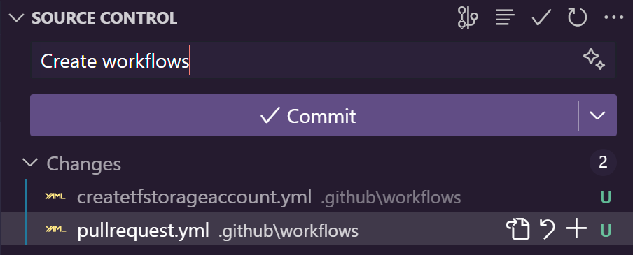
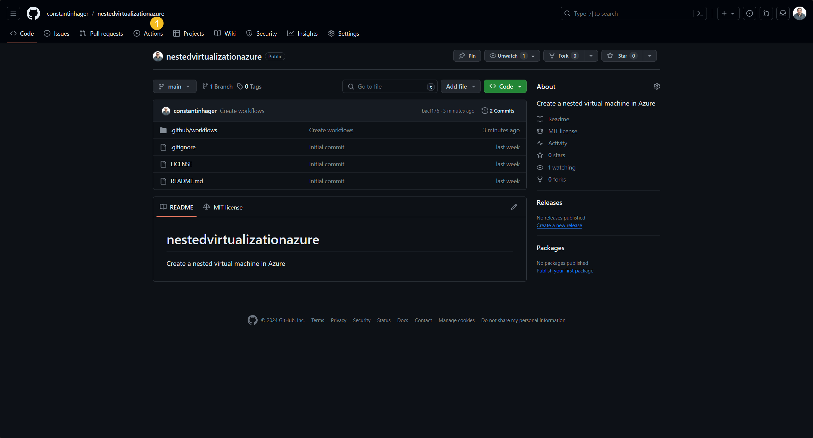
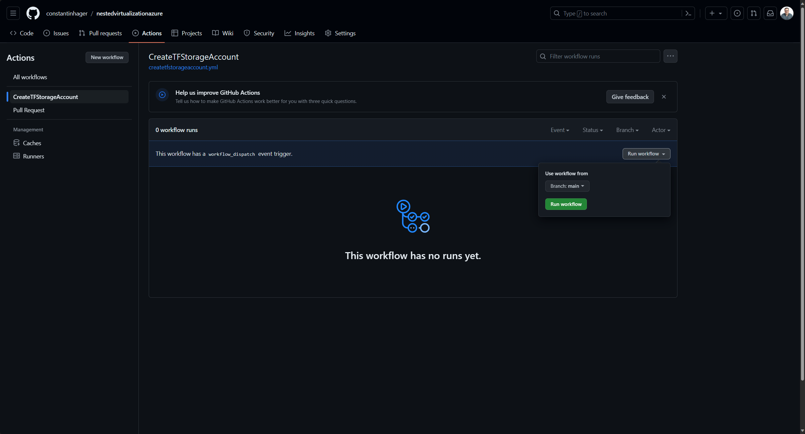
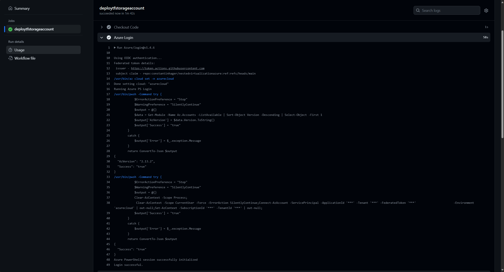
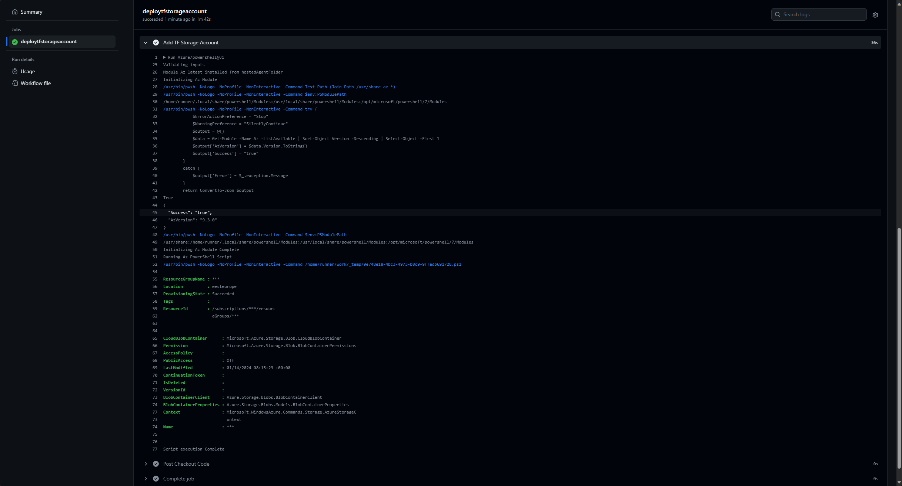
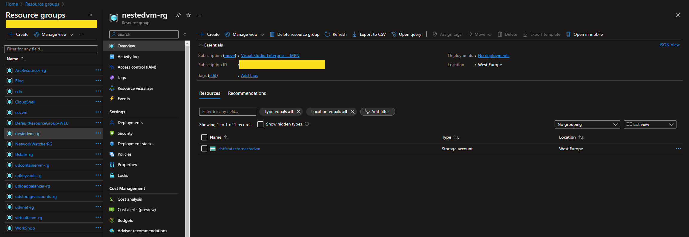

Series Table of contents:

- [Part 1: Infrastructure planning]()
- [Part 2: Prepare GitHub]()

We continue our journey of building a nested virtual machine in Azure.
In the following article, I will discuss the following aspect:

- Create the GitHub Workflows

## What are GitHub Workflows?

A workflow is a configurable automated process that will run one or more jobs. Workflows are defined by a YAML file
checked in to your repository and will run when triggered by an event in your repository, or they can be triggered
manually, or at a defined schedule.

Workflows are defined in the .github/workflows directory in a repository, and a repository can have multiple workflows,
each of which can perform a different set of tasks.

If you want to learn more check out the official [GitHub documentation](https://docs.github.com/en/actions/using-workflows/about-workflows)

We will create the following workflows:
- A workflow that triggers if a pull request is created.
- A workflow that triggers the Terraform Azure Storage Account.

## Clone the GitHub repository

<blockquote class="prompt-tip">
    Your local machine must have GIT installed.
</blockquote>

To generate files within our recently created GitHub repository, it is necessary to first
clone the repository from GitHub.

To clone the repository to your local machine, select the "Code" button within your repository,
switch to the local tab and copy the HTTPS URL.



Inside of Visual Studio Code press CTRL + SHIFT + P (or F1, or CMD + SHIFT + P) to open the command palette
and select "GIT: Clone".



Paste the GitHub URL and press the ENTER key, select a local folder and click on "Select as Repository Destination".
Select "Open" to reload Visual Studio Code with the cloned repository.

<blockquote class="prompt-tip">
    If you're logged into GitHub within Visual Studio Code, you can also utilize the "Clone from GitHub" option.
    You can also authenticate to GitHub from within Visual Studio Code.
</blockquote>

## Set up the GitHub workflows

create the .github/workflows folder structure



### Deploy Terraform Storage Account workflow (deploytfstorageaccount.yml)

```yml
name: CreateTFStorageAccount

on:
  workflow_dispatch:

permissions:
  id-token: write
  issues: write
  pull-requests: write
  contents: read

jobs:
  deploytfstorageaccount:
    runs-on: ubuntu-latest

    steps:
      - name: Checkout Code
        uses: actions/checkout@v3

      - name: Azure Login
        uses: Azure/login@v1.4.6
        with:
          client-id: ${{secrets.AZURE_CLIENT_ID}}
          tenant-id: ${{secrets.AZURE_TENANT_ID}}
          subscription-id: ${{secrets.AZURE_SUBSCRIPTION_ID}}
          enable-AzPSSession: true

      - name: Add TF Storage Account
        uses: Azure/powershell@v1
        with:
          inlineScript: |
            $Param = @{
              Name     = $Env:RESOURCE_GROUP_NAME
              Location = $Env:STORAGE_ACCOUNT_LOCATION
            }
            New-AzResourceGroup @Param

            $Param = @{
              ResourceGroupName = $Env:RESOURCE_GROUP_NAME
              Name              = $Env:STORAGE_ACCOUNT_NAME
              Location          = $Env:STORAGE_ACCOUNT_LOCATION
              SkuName           = $Env:STORAGE_ACCOUNT_SKU
            }
            $StorageAccount = New-AzStorageAccount @Param

            $Param = @{
              Name    = $Env:STORAGE_CONTAINER_NAME
              Context = $StorageAccount.Context
            }
            New-AzStorageContainer @Param
          azPSVersion: latest
        env:
          RESOURCE_GROUP_NAME: ${{secrets.RESOURCE_GROUP_NAME}}
          STORAGE_ACCOUNT_NAME: ${{secrets.STORAGE_ACCOUNT}}
          STORAGE_CONTAINER_NAME: ${{secrets.CONTAINER_NAME}}
          STORAGE_ACCOUNT_LOCATION: West Europe
          STORAGE_ACCOUNT_SKU: Standard_LRS
```

### Pull Request workflow (pullrequest.yml)

<blockquote class="prompt-tip">
    The workflow might be adjusted based on your Pull Request.
    The Terraform steps will be featured in the upcoming blog post.
</blockquote>

```yml
name: Pull Request

on:
  pull_request:
    branches:
      - main

env:
  TF_LOG: INFO

permissions:
  id-token: write
  issues: write
  pull-requests: write
  contents: read
jobs:
  pr-infra-check:
    runs-on: ubuntu-latest
    steps:
      # Checkout the repository to the GitHub Actions runner
      - name: Checkout
        uses: actions/checkout@v2

      # Install the latest version of Terraform CLI
      - name: Setup Terraform
        uses: hashicorp/setup-terraform@v1

      # Log into Azure with OIDC integration
      - name: "Az CLI login"
        uses: azure/login@v1
        with:
          client-id: ${{ secrets.AZURE_CLIENT_ID }}
          tenant-id: ${{ secrets.AZURE_TENANT_ID }}
          subscription-id: ${{ secrets.AZURE_SUBSCRIPTION_ID }}

      # Run az commands to confirm sub access
      - name: "Run az commands"
        run: |
          az account show

      # Run Terraform init
      #- name: Terraform Init
      #  id: init
      #  env:
      #    STORAGE_ACCOUNT: ${{ secrets.STORAGE_ACCOUNT }}
      #    CONTAINER_NAME: ${{ secrets.CONTAINER_NAME }}
      #    RESOURCE_GROUP_NAME: ${{ secrets.RESOURCE_GROUP_NAME }}
      #    ARM_CLIENT_ID: ${{ secrets.AZURE_CLIENT_ID }}
      #    ARM_SUBSCRIPTION_ID: ${{ secrets.AZURE_SUBSCRIPTION_ID }}
      #    ARM_TENANT_ID: ${{ secrets.AZURE_TENANT_ID }}
      #  run: terraform init -backend-config="storage_account_name=$STORAGE_ACCOUNT" -backend-config="container_name=$CONTAINER_NAME" -backend-config="resource_group_name=$RESOURCE_GROUP_NAME"
      #  working-directory: <your working directory inside of the GitHub repository>

      # Run a Terraform validate
      #- name: Terraform validate
      #  id: validate
      #  if: success() || failure()
      #  env:
      #    ARM_CLIENT_ID: ${{ secrets.AZURE_CLIENT_ID }}
      #    ARM_SUBSCRIPTION_ID: ${{ secrets.AZURE_SUBSCRIPTION_ID }}
      #    ARM_TENANT_ID: ${{ secrets.AZURE_TENANT_ID }}
      #  run: terraform validate -no-color
      #  working-directory: <your working directory inside of the GitHub repository>

      # Run a Terraform plan
      #- name: Terraform plan
      #  id: plan
      #  env:
      #    ARM_CLIENT_ID: ${{ secrets.AZURE_CLIENT_ID }}
      #    ARM_SUBSCRIPTION_ID: ${{ secrets.AZURE_SUBSCRIPTION_ID }}
      #    ARM_TENANT_ID: ${{ secrets.AZURE_TENANT_ID }}
      #  run: terraform plan -no-color
      #  working-directory: <your working directory inside of the GitHub repository>

      # Add a comment to pull requests with plan results
      #- name: Add Plan Comment
      #  id: comment
      #  uses: actions/github-script@v3
      #  env:
      #    PLAN: "terraform\n${{ steps.plan.outputs.stdout }}"
      #  with:
      #    github-token: ${{ secrets.GITHUB_TOKEN }}
      #    script: |
      #      const output = `#### Terraform Format and Style 🖌\`${{ steps.fmt.outcome }}\`
      #      #### Terraform Initialization ⚙️\`${{ steps.init.outcome }}\`
      #      #### Terraform Validation 🤖${{ steps.validate.outputs.stdout }}
      #      #### Terraform Plan 📖\`${{ steps.plan.outcome }}\`

      #      <details><summary>Show Plan</summary>

      #      \`\`\`${process.env.PLAN}\`\`\`

      #      </details>

      #      *Pusher: @${{ github.actor }}, Action: \`${{ github.event_name }}\`, Working Directory: \`${{ env.tf_actions_working_dir }}\`, Workflow: \`${{ github.workflow }}\`*`;

      #      github.issues.createComment({
      #        issue_number: context.issue.number,
      #        owner: context.repo.owner,
      #        repo: context.repo.repo,
      #        body: output
      #      })

```

Generate the files and insert the provided code into them.

End result:



Commit them to the repository.



## Create the Terraform Storage Account

Navigate to your GitHub repository inside of a browser and select "Actions".



Select "CreateTFStorageAccount", select "Run workflow" and select "Run workflow"









That concludes part 3. In the next blog post, we will use Terraform to create the Azure resources.
