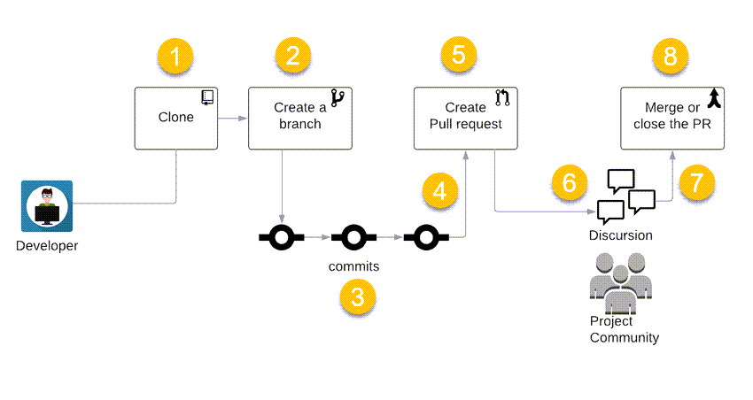

Series Table of contents:

- [Part 1: Infrastructure planning]()
- [Part 2: Prepare GitHub]()
- [Part 3: GitHub Workflows]()

We continue our journey of building a nested virtual machine in Azure.
In the following article, I will discuss the following aspect:

- What is Terraform?
- Deploy with Pull Request workflow

## What is Terraform?

Terraform is an open-source infrastructure as code (IaC) tool developed by HashiCorp. It enables users to define and
provision infrastructure in a declarative configuration language. You specify what resources you want, and Terraform
figures out how to create and manage them.

With Terraform, you can describe your infrastructure,
such as servers, networks, and storage, in a configuration file, and then use Terraform to create and manage that
infrastructure.

## Deploy with Pull Request workflow

A pull request (PR) is a mechanism for making changes to a codebase in a collaborative development environment,
such as Git repositories.

Here's how the typical pull request process works:

**Forking the Repository:** If you want to contribute to a project, you typically start by forking the repository
of that project. This creates a copy of the repository in your own GitHub account.
In our situation, it is not a requirement since we have ownership of the project.

1. **Clone the Repository:** Cloning provides developers with a complete and independent copy of the project's codebase,
commit history, and other associated files on their local machine.
After cloning, developers can work on the code locally, make changes, create branches, and commit their modifications.
The local copy remains linked to the original repository, allowing developers to pull in updates from the remote
source and push their changes back when ready.

2. **Creating a Branch:** Create a new branch in our repository.
This branch is where you make your changes and improvements.

3. **Making Changes:** You make your changes and commit them to your branch.
Each commit represents a specific set of changes.

4. **Pushing Changes:** Once you are satisfied with your changes, you push your branch with the new commits to the repository.

5. **Opening a Pull Request:** After pushing your changes, you can open a pull request. This is a request to the
repository maintainers to review and potentially merge your changes into the main branch of their repository.

6. **Review and Discussion:** Other contributors or maintainers can review your changes within the pull request.
They may provide feedback, ask questions, or suggest modifications. In our situation, it is not a requirement since we
have ownership of the project.

7. **Continuous Integration (CI) Checks:** Many projects use CI systems to automatically run tests and checks on
incoming pull requests. This ensures that the changes meet the project's standards and do not introduce new issues.
In our scenario, we established a pull request CI pipeline to verify the successful execution of the Terraform code.

8. **Merge or Close:** If the changes are approved, a project maintainer can merge the pull request,
incorporating your changes into the main branch. If there are issues or more changes are needed,
the pull request may be closed without merging, and the contributor can make further adjustments.

That's it for this blog post. In the next part we will start with the Terraform Deployment of the infrastructure.
