Series Table of contents:

- [Part 1: Infrastructure planning]()
- [Part 2: Prepare GitHub]()
- [Part 3: GitHub Workflows]()
- [Part 4: Terraform Deployment]()

We continue our journey of building a nested virtual machine in Azure. In the following article, I will discuss the following aspect:

Deploy the infrastructure with GitHub Actions and Terraform.

## Create the Terraform folder structure

To organize our Terraform code, we will create a folder structure that separates different components of our infrastructure. This will help us manage our code more effectively and make it easier to navigate.

Here is a suggested folder structure for our Terraform code:

```
├── Terraform
│   ├── main.tf
│   ├── var.tf
│   └── terraform.tf
```

In this structure:
- `main.tf` will contain the main configuration for our infrastructure.
- `var.tf` will define the variables we will use in our configuration.
- `terraform.tf` will define the Terraform backend and provider configurations.
- The `Terraform` folder will contain the `main.tf`, `var.tf`, and `terraform.tf` files to manage all resources related to our infrastructure.

## Create a branch for Terraform configuration

But first we are creating a branch for our Terraform configuration. This allows us to work on our infrastructure code without affecting the main branch of our repository. Once we have completed our changes and tested them, we can create a pull request to merge our changes back into the main branch.

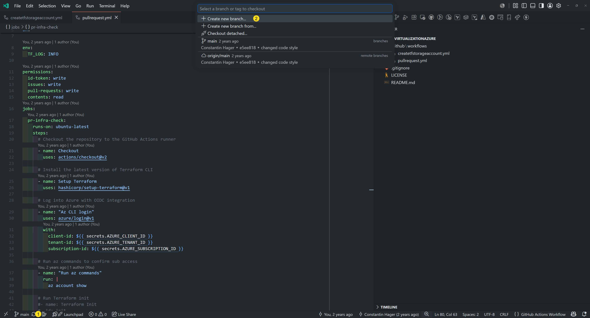

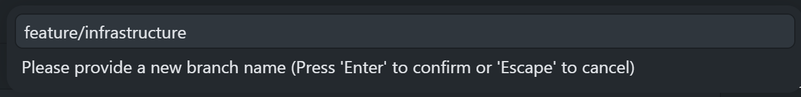

<blockquote class="prompt-tip">
    Do not forget to push your branch to the remote repository on GitHub after creating it locally.
</blockquote>

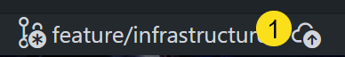

## Create the github workflow for Terraform deployment

In our GitHub repository, we will create a new workflow file that will define the steps to deploy our infrastructure using Terraform. This workflow will be triggered when we push changes to our main branch. This is also a manual trigger, so we can decide when to deploy our infrastructure.

So we will create a new file in the `.github/workflows` folder called `deploy.yml`. This file will contain the configuration for our GitHub Actions workflow that will automate the deployment of our infrastructure using Terraform.

```yaml
name: Deploy Nested Virtualization VM

on:
  workflow_dispatch:

env:
  TF_LOG: INFO

permissions:
  id-token: write
  contents: read
jobs:
  deploy-infra:
    runs-on: ubuntu-latest
    steps:
      # Checkout the repository to the GitHub Actions runner
      - name: Checkout
        uses: actions/checkout@v2

      # Install the latest version of Terraform CLI
      - name: Setup Terraform
        uses: hashicorp/setup-terraform@v4

      # Log into Azure with OIDC integration
      - name: "Az CLI login"
        uses: azure/login@v3
        with:
          client-id: ${{ secrets.AZURE_CLIENT_ID }}
          tenant-id: ${{ secrets.AZURE_TENANT_ID }}
          subscription-id: ${{ secrets.AZURE_SUBSCRIPTION_ID }}

      # Run Terraform init
      - name: Terraform Init
        id: init
        env:
          STORAGE_ACCOUNT: ${{ secrets.STORAGE_ACCOUNT }}
          CONTAINER_NAME: ${{ secrets.CONTAINER_NAME }}
          RESOURCE_GROUP_NAME: ${{ secrets.RESOURCE_GROUP_NAME }}
          ARM_CLIENT_ID: ${{ secrets.AZURE_CLIENT_ID }}
          ARM_SUBSCRIPTION_ID: ${{ secrets.AZURE_SUBSCRIPTION_ID }}
          ARM_TENANT_ID: ${{ secrets.AZURE_TENANT_ID }}
        run: terraform init -backend-config="storage_account_name=$STORAGE_ACCOUNT" -backend-config="container_name=$CONTAINER_NAME" -backend-config="resource_group_name=$RESOURCE_GROUP_NAME"
        working-directory: ./Terraform

      # Run a Terraform apply
      - name: Terraform apply
        id: apply
        env:
          ARM_CLIENT_ID: ${{ secrets.AZURE_CLIENT_ID }}
          ARM_SUBSCRIPTION_ID: ${{ secrets.AZURE_SUBSCRIPTION_ID }}
          ARM_TENANT_ID: ${{ secrets.AZURE_TENANT_ID }}
        run: terraform apply -auto-approve
        working-directory: ./Terraform
```
In this workflow:
- We define the name of the workflow as "Deploy Nested Virtualization VM".
- We specify that the workflow should be triggered manually using `workflow_dispatch`.
- We set the environment variable `TF_LOG` to `INFO` to enable detailed logging for Terraform.
- We define the permissions required for the workflow, including `id-token` for authentication and `contents` for reading the repository.
- We define a job called `deploy-infra` that runs on the latest version of Ubuntu.
- We include steps to checkout the repository, set up Terraform, log into Azure using OIDC integration, run `terraform init` to initialize the Terraform configuration,and run `terraform apply` to deploy the infrastructure.

## Change the pullrequest.yml
In the `pullrequest.yml` workflow file, we uncomment the steps for Terraform plan when a pull request is created or updated. This will allow us to see the changes that will be made to our infrastructure before we merge the pull request.

```yaml
name: Pull Request

on:
  pull_request:
    branches:
      - main

env:
  TF_LOG: INFO

permissions:
  id-token: write
  issues: write
  pull-requests: write
  contents: read
jobs:
  pr-infra-check:
    runs-on: ubuntu-latest
    steps:
      # Checkout the repository to the GitHub Actions runner
      - name: Checkout
        uses: actions/checkout@v2

      # Install the latest version of Terraform CLI
      - name: Setup Terraform
        uses: hashicorp/setup-terraform@v4

      # Log into Azure with OIDC integration
      - name: "Az CLI login"
        uses: azure/login@v3
        with:
          client-id: ${{ secrets.AZURE_CLIENT_ID }}
          tenant-id: ${{ secrets.AZURE_TENANT_ID }}
          subscription-id: ${{ secrets.AZURE_SUBSCRIPTION_ID }}

      # Run az commands to confirm sub access
      - name: "Run az commands"
        run: |
          az account show
          az storage account list --resource-group nestedvm-rg

      - name: Terraform Init
        id: init
        env:
          STORAGE_ACCOUNT: ${{ secrets.STORAGE_ACCOUNT }}
          CONTAINER_NAME: ${{ secrets.CONTAINER_NAME }}
          RESOURCE_GROUP_NAME: ${{ secrets.RESOURCE_GROUP_NAME }}
          ARM_CLIENT_ID: ${{ secrets.AZURE_CLIENT_ID }}
          ARM_SUBSCRIPTION_ID: ${{ secrets.AZURE_SUBSCRIPTION_ID }}
          ARM_TENANT_ID: ${{ secrets.AZURE_TENANT_ID }}
          ARM_USE_AZUREAD: true
          ARM_USE_OIDC: true
        run: terraform init -backend-config="storage_account_name=$STORAGE_ACCOUNT" -backend-config="container_name=$CONTAINER_NAME" -backend-config="resource_group_name=$RESOURCE_GROUP_NAME"
        working-directory: ./Terraform

      # Run a Terraform validate
      - name: Terraform validate
        id: validate
        if: success() || failure()
        env:
          ARM_CLIENT_ID: ${{ secrets.AZURE_CLIENT_ID }}
          ARM_SUBSCRIPTION_ID: ${{ secrets.AZURE_SUBSCRIPTION_ID }}
          ARM_TENANT_ID: ${{ secrets.AZURE_TENANT_ID }}
          ARM_USE_AZUREAD: true
          ARM_USE_OIDC: true
        run: terraform validate -no-color
        working-directory: ./Terraform

      # Run a Terraform plan
      - name: Terraform plan
        id: plan
        env:
          ARM_CLIENT_ID: ${{ secrets.AZURE_CLIENT_ID }}
          ARM_SUBSCRIPTION_ID: ${{ secrets.AZURE_SUBSCRIPTION_ID }}
          ARM_TENANT_ID: ${{ secrets.AZURE_TENANT_ID }}
          ARM_USE_AZUREAD: true
          ARM_USE_OIDC: true
        run: terraform plan -no-color
        working-directory: ./Terraform

      # Add a comment to pull requests with plan results
      - name: Add Plan Comment
        id: comment
        uses: actions/github-script@v9
        env:
          PLAN: "terraform\n${{ steps.plan.outputs.stdout }}"
        with:
          github-token: ${{ secrets.GITHUB_TOKEN }}
          script: |
            const output = `#### Terraform Format and Style 🖌\`${{ steps.fmt.outcome }}\`
            #### Terraform Initialization ⚙️\`${{ steps.init.outcome }}\`
            #### Terraform Validation 🤖${{ steps.validate.outputs.stdout }}
            #### Terraform Plan 📖\`${{ steps.plan.outcome }}\`

            <details><summary>Show Plan</summary>

            \`\`\`${process.env.PLAN}\`\`\`

            </details>

            *Pusher: @${{ github.actor }}, Action: \`${{ github.event_name }}\`, Working Directory: \`${{ env.tf_actions_working_dir }}\`, Workflow: \`${{ github.workflow }}\`*`;

            github.issues.createComment({
              issue_number: context.issue.number,
              owner: context.repo.owner,
              repo: context.repo.repo,
              body: output
            })
```

## Create the Terraform configuration files

In the `Terraform` folder, we will create three files: `main.tf`, `var.tf`, and `terraform.tf`.

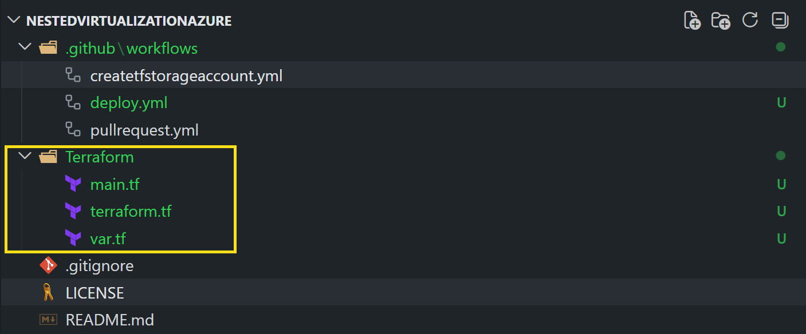

## Create the Terraform configuration
Now that we have our folder structure in place, we can start creating our Terraform configuration. We will define the resources we need for our nested virtual machine in Azure, such as virtual networks, subnets, virtual machines, and storage accounts.

### terraform.tf
In the `terraform.tf` file, we will define the Terraform backend and provider configurations. This file will specify how Terraform should connect to Azure and where it should store its state files.

```hcl
terraform {
  required_providers {
    azurerm = {
      source  = "hashicorp/azurerm"
      version = "~> 3.0"
    }
  }

  backend "azurerm" {
    key                    = "terraform.tfstate"
    use_oidc               = true
    use_azuread_auth       = true
  }
}
```

## Virtual Network Configuration

In the `main.tf` file, we will define our virtual network and subnet resources.

```hcl
#region local variables
locals {
  # Everything related to the virtual network
  resource_group_name = "nestedvm-rg"
  location            = "West Europe"
  vnetname            = "nestedvm-vnet"
  addresspace         = ["10.1.0.0/16"]
  subnetname          = "nestedvm-subnet"
  addressprefixes     = ["10.1.1.0/24"]
}
#endregion

#region Virtual Network
resource "azurerm_virtual_network" "udvnet" {
  name                = local.vnetname
  location            = local.location
  resource_group_name = local.resource_group_name
  address_space       = local.addresspace

  tags = {
    "Function" = "VNet for Nested Virtualization Lab"
  }
}

resource "azurerm_subnet" "vmcontainersubnet" {
  name                 = local.subnetname
  resource_group_name  = local.resource_group_name
  virtual_network_name = azurerm_virtual_network.udvnet.name
  address_prefixes     = local.addressprefixes
}
#endregion
```

## Pull request and merge the Terraform configuration
After we have created our Terraform configuration files, we will commit our changes and push them to our remote repository on GitHub. Then we will create a pull request to merge our changes into the main branch. This will allow us to review our changes and ensure that everything is correct before we deploy our infrastructure.

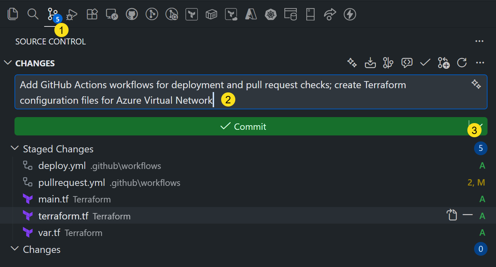

Select from the dropdown in step 3 Commit & Push.

## Create a pull request
After pushing our changes to the remote repository, we will create a pull request to merge our changes into the main branch. This will allow us to review our changes and ensure that everything is correct before we deploy our infrastructure.

On the GitHub repository page, click on the "Pull requests" tab and then click on the "New pull request" button. Select the branch you just pushed as the source branch and the main branch as the target branch. Add a title and description for your pull request, and then click on the "Create pull request" button.

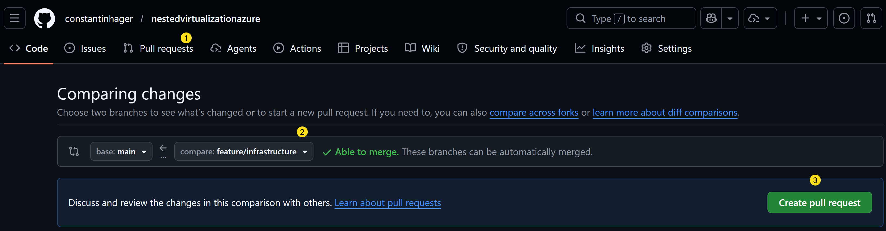

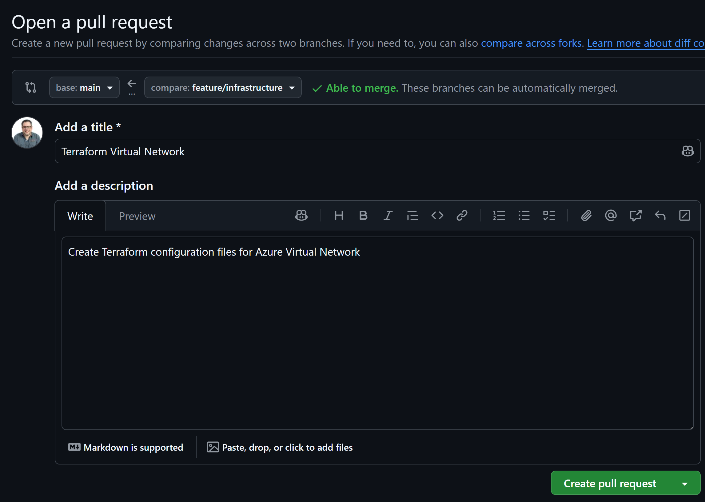

The pipeline is now automatically triggered and will run the Terraform plan to show us the changes that will be made to our infrastructure. We can review the plan output in the pull request comments to ensure that everything looks correct before we merge our changes.

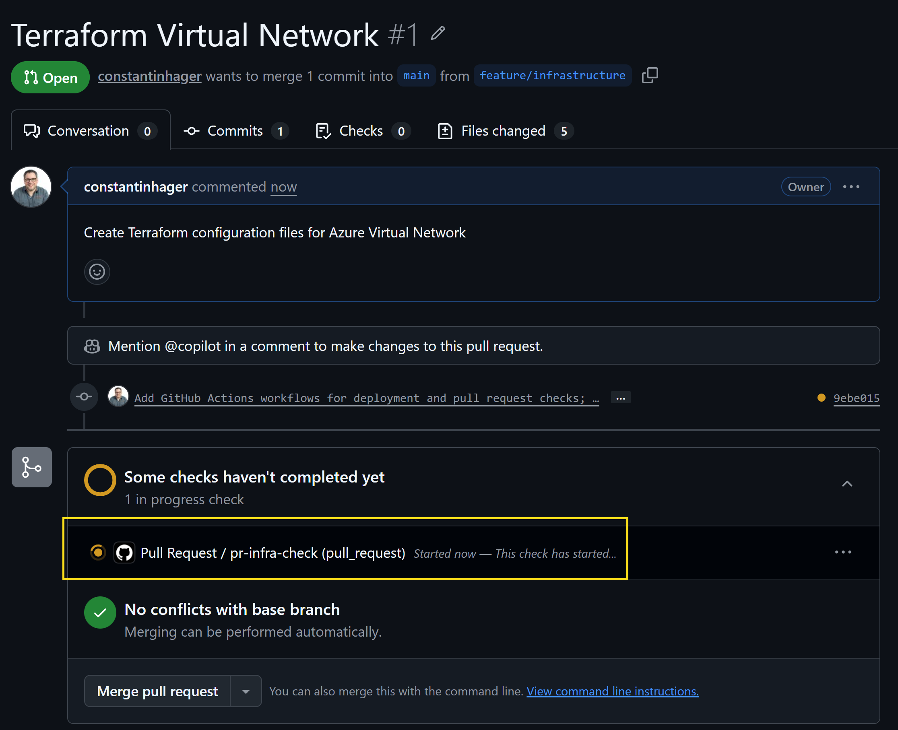

This is the output of the Terraform plan in the pull request comments. We can see that it will create a virtual network, and subnet for our nested virtual machine lab environment.

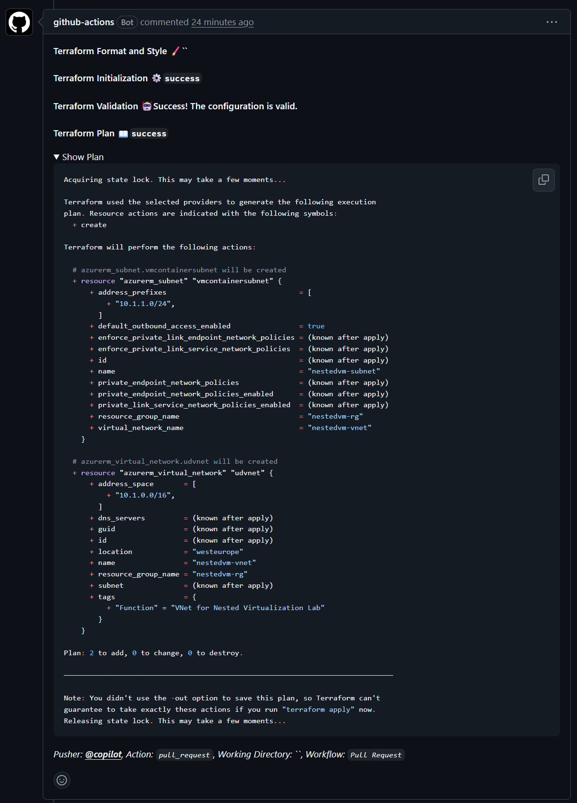

Now we can merge our pull request to the main branch.

## Deploy the infrastructure
After merging our pull request, we can now deploy our infrastructure using the GitHub Actions workflow we created earlier. We will go to the "Actions" tab in our GitHub repository, select the "Deploy Nested Virtualization VM" workflow, and then click on the "Run workflow" button. This will trigger the workflow to deploy our infrastructure using Terraform. We can monitor the progress of the deployment in the workflow logs.

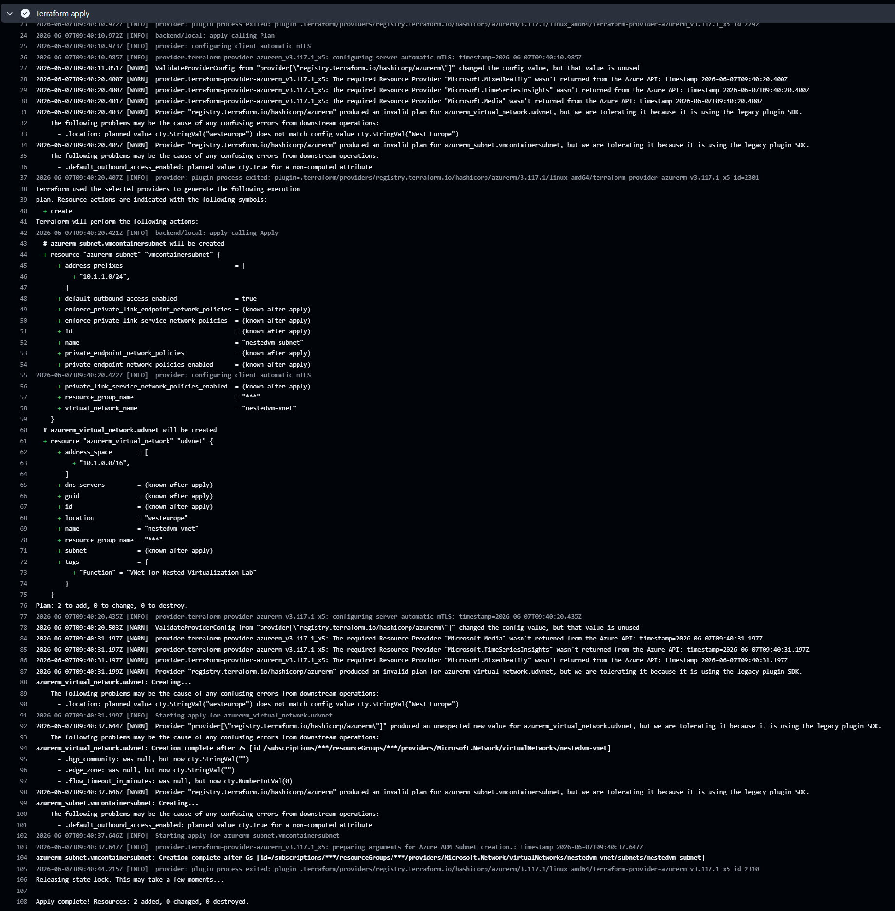


## Load Balancer
Next we will add a load balancer to our Terraform configuration. This will allow us to securely Remote Desktop into our nested virtual machine with a high port. We will define the load balancer resource in our `main.tf` file.

```hcl
locals {
  # Everything related to the virtual network
  resource_group_name = "nestedvm-rg"
  location            = "West Europe"
  vnetname            = "nestedvm-vnet"
  addresspace         = ["172.16.0.0/16"]
  subnetname          = "nestedvm-snet"
  addressprefixes     = ["172.16.0.0/24"]

  # Everything related to the load balancer
  pipname             = "nestedvm-pip"
  lbname              = "nestedvm-lb"
}

#region Load Balancer
#region Public IP
resource "azurerm_public_ip" "lbpip" {
  name                = local.pipname
  location            = local.location
  resource_group_name = local.resource_group_name
  allocation_method   = "Static"
  sku                 = "Standard"

  tags = {
    "Function" = "Public IP for the loadbalancer"
  }
}
#endregion

#region Load Balancer
resource "azurerm_lb" "lb" {
  name                = local.lbname
  location            = local.location
  resource_group_name = local.resource_group_name
  sku                 = "Standard"

  frontend_ip_configuration {
    name                 = "PublicIPAddress"
    public_ip_address_id = azurerm_public_ip.lbpip.id
  }

  tags = {
    "Function" = "Loadbalancer for the Nested Virtualization Lab"
  }
}
#endregion

#region Backend Address Pool
resource "azurerm_lb_backend_address_pool" "bap" {
  loadbalancer_id = azurerm_lb.lb.id
  name            = "NestedVMBackendPool"
}
#endregion
#region Probe
resource "azurerm_lb_probe" "ssh" {
  loadbalancer_id = azurerm_lb.lb.id
  name            = "rdp-probe"
  port            = 3389
}
#endregion

#region Nat Rule RDP
resource "azurerm_lb_nat_rule" "rdp" {
  resource_group_name            = local.resource_group_name
  loadbalancer_id                = azurerm_lb.lb.id
  name                           = "rdp-nat-rule"
  protocol                       = "Tcp"
  frontend_port                  = 61412
  backend_port                   = 3389
  frontend_ip_configuration_name = azurerm_lb.lb.frontend_ip_configuration[0].name
}
#endregion

#region Outbound Rule
resource "azurerm_lb_outbound_rule" "internet" {
  name                    = "Internet"
  loadbalancer_id         = azurerm_lb.lb.id
  protocol                = "Tcp"
  backend_address_pool_id = azurerm_lb_backend_address_pool.bap.id

  frontend_ip_configuration {
    name = azurerm_lb.lb.frontend_ip_configuration[0].name
  }
}
#endregion
#endregion
```

Commit and push your changes to the remote repository, and then create a pull request to merge your changes into the main branch. After merging, run the deployment workflow to deploy the load balancer along with the virtual network and subnet.

## Network Security Group
Next we will add a Network Security Group (NSG) to our Terraform configuration. This will allow us to control the inbound and outbound traffic to our nested virtual machine. We will define the NSG resource in our `main.tf` file. In our case we will allow inbound RDP traffic from the load balancer to our nested virtual machine.

```hcl
locals {
  # Everything related to the virtual network
  resource_group_name = "nestedvm-rg"
  location            = "West Europe"
  vnetname            = "nestedvm-vnet"
  addresspace         = ["172.16.0.0/16"]
  subnetname          = "nestedvm-snet"
  addressprefixes     = ["172.16.0.0/24"]

  # Everything related to the load balancer
  pipname             = "nestedvm-pip"
  lbname              = "nestedvm-lb"

  # Everything related to the network security group
  nsgName             = "nestedvm-nsg"
}

#region Network Security Group
resource "azurerm_network_security_group" "nsg" {
  name                = local.nsgName
  location            = local.location
  resource_group_name = local.resource_group_name
  tags = {
    environment = "NSG for Nested Virtualization Lab"
  }
}

resource "azurerm_network_security_rule" "rdp" {
  name                        = "Allow-RDP"
  priority                    = 100
  direction                   = "Inbound"
  access                      = "Allow"
  protocol                    = "Tcp"
  source_port_range           = "*"
  destination_port_range      = "3389"
  source_address_prefix       = "*"
  destination_address_prefix  = "172.16.0.4"
  resource_group_name         = local.resource_group_name
  network_security_group_name = azurerm_network_security_group.nsg.name
}
#endregion
```

After adding the NSG configuration, commit and push your changes to the remote repository, and then create a pull request to merge your changes into the main branch. After merging, run the deployment workflow to deploy the NSG along with the load balancer, virtual network, and subnet.

## Virtual Machine
Finally, we will add the virtual machine resource to our Terraform configuration. This will allow us to create the nested virtual machine in Azure. We will define the virtual machine resource in our `main.tf` file.

## Add Secret for Admin Password
Before we can add the virtual machine resource to our Terraform configuration, we need to add a secret for the administrator password in our GitHub repository. This will allow us to securely store the password and use it in our Terraform configuration without exposing it in our code.

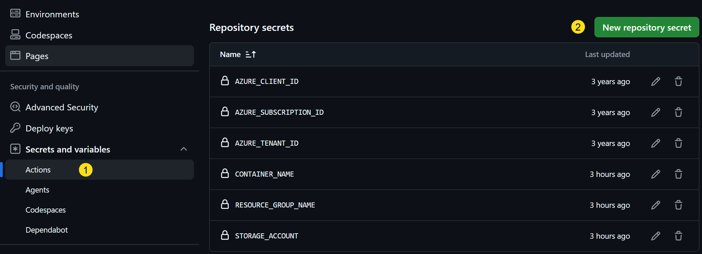
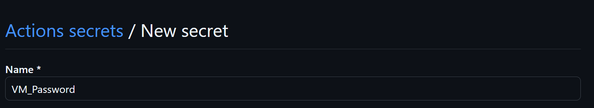
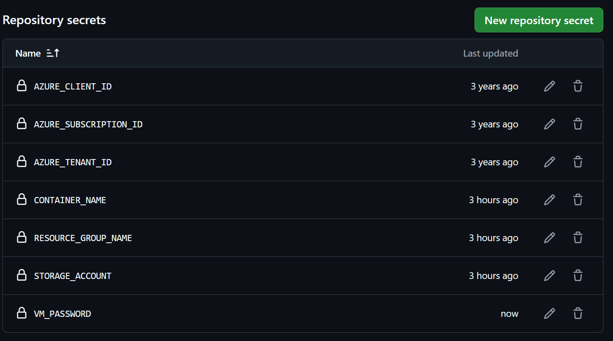

## Add Variables for Virtual Machine Password
Next, we will add variables for the virtual machine administrator password in our `var.tf` file. This will allow us to reference the password in our Terraform configuration without hardcoding it.

```hcl
variable "admin_password" {
  description = "The administrator password for the virtual machine"
  type        = string
  sensitive   = true
}
```

## Add Environment Variable for Virtual Machine Password
Next, we will add an environment variable for the virtual machine administrator password in our GitHub Actions workflow. This will allow us to pass the password from our GitHub repository secrets to our Terraform configuration when we run the deployment workflow. We will add the environment variable in both the `deploy.yml` and `pullrequest.yml` workflow files.

In the `deploy.yml` file, we will add the following environment variable to the Terraform apply step:

```yaml
      - name: Terraform apply
        id: apply
        env:
          ARM_CLIENT_ID: ${{ secrets.AZURE_CLIENT_ID }}
          ARM_SUBSCRIPTION_ID: ${{ secrets.AZURE_SUBSCRIPTION_ID }}
          ARM_TENANT_ID: ${{ secrets.AZURE_TENANT_ID }}
          ARM_USE_AZUREAD: true
          ARM_USE_OIDC: true
          VM_PASSWORD: ${{ secrets.VM_PASSWORD }}
        run: terraform apply -auto-approve -var="vm_Password=$VM_PASSWORD"
        working-directory: ./Terraform
```

in the `pullrequest.yml` file, we will add the following environment variable to the Terraform plan step:

```yaml
      - name: Terraform plan
        id: plan
        env:
          ARM_CLIENT_ID: ${{ secrets.AZURE_CLIENT_ID }}
          ARM_SUBSCRIPTION_ID: ${{ secrets.AZURE_SUBSCRIPTION_ID }}
          ARM_TENANT_ID: ${{ secrets.AZURE_TENANT_ID }}
          ARM_USE_AZUREAD: true
          ARM_USE_OIDC: true
          VM_PASSWORD: ${{ secrets.VM_PASSWORD }}
        run: terraform plan -no-color -var="vm_Password=$VM_PASSWORD"
        working-directory: ./Terraform
```

## Add Virtual Machine Resource
Finally, we will add the virtual machine resource to our `main.tf` file. This will allow us to create the nested virtual machine in Azure.

```hcl
locals {
  # Everything related to the virtual network
  resource_group_name = "nestedvm-rg"
  location            = "West Europe"
  vnetname            = "nestedvm-vnet"
  addresspace         = ["172.16.0.0/16"]
  subnetname          = "nestedvm-snet"
  addressprefixes     = ["172.16.0.0/24"]

  # Everything related to the load balancer
  pipname             = "nestedvm-pip"
  lbname              = "nestedvm-lb"

  # Everything related to the network security group
  nsgName             = "nestedvm-nsg"

  # Everything related to the virtual machine
  nicname             = "nestedvm-nic"
  vmName              = "nestedvm-vm"
}

#region Data sources
data "azurerm_subnet" "subnet" {
  name                 = "nestedvm-snet"
  resource_group_name  = "nestedvm-rg"
  virtual_network_name = "nestedvm-vnet"
}

data "azurerm_lb" "lb" {
  name                = "nestedvm-lb"
  resource_group_name = "nestedvm-rg"
}

data "azurerm_lb_backend_address_pool" "lbpool" {
  name            = "NestedVMBackendPool"
  loadbalancer_id = data.azurerm_lb.lb.id
}
#endregion

#region Virtual Machine
#region Create NIC
resource "azurerm_network_interface" "nestedvmnic" {
  name                = local.nicname
  location            = local.location
  resource_group_name = local.resource_group_name

  ip_configuration {
    name                          = "internal"
    subnet_id                     = data.azurerm_subnet.subnet.id
    private_ip_address_allocation = "Static"
    private_ip_address            = "172.16.0.4"
  }

  tags = {
    "Function" = "NIC for the Nested Virtual Machine lab"
  }
}
#endregion

#region Associate NIC to Backend Address Pool
resource "azurerm_network_interface_backend_address_pool_association" "nestedvmtoadloadbalancer" {
  network_interface_id    = azurerm_network_interface.nestedvmnic.id
  ip_configuration_name   = azurerm_network_interface.nestedvmnic.ip_configuration[0].name
  backend_address_pool_id = data.azurerm_lb_backend_address_pool.lbpool.id
}
#endregion

#region Associate NIC to Nat Rule
resource "azurerm_network_interface_nat_rule_association" "nestedvmtonatrule" {
  network_interface_id  = azurerm_network_interface.nestedvmnic.id
  ip_configuration_name = azurerm_network_interface.nestedvmnic.ip_configuration[0].name
  nat_rule_id           = azurerm_lb_nat_rule.rdp.id
}
#endregion

#region Associate NIC to Security Group
resource "azurerm_network_interface_security_group_association" "nitonsg" {
  network_interface_id      = azurerm_network_interface.nestedvmnic.id
  network_security_group_id = azurerm_network_security_group.nsg.id
}

#endregion

#region Virtual Machine
resource "azurerm_windows_virtual_machine" "nestedvm" {
  name                = local.vmName
  resource_group_name = local.resource_group_name
  location            = local.location
  size                = "Standard_D4s_v4"
  admin_username      = "azureuser"
  admin_password      = var.vm_Password
  network_interface_ids = [
    azurerm_network_interface.nestedvmnic.id,
  ]

  os_disk {
    caching              = "ReadWrite"
    storage_account_type = "Standard_LRS"
    name                 = "${local.vmName}-osdisk"
  }

  identity {
    type = "SystemAssigned"
  }

  boot_diagnostics {
    storage_account_uri = null
  }

  source_image_reference {
    publisher = "MicrosoftWindowsServer"
    offer     = "WindowsServer"
    sku       = "2025-datacenter"
    version   = "latest"
  }

  vtpm_enabled = false
  secure_boot_enabled = false
  timezone = "W. Europe Standard Time"

  tags = {
    "Function" = "Nested Virtual Machine for the Nested Virtualization Lab"
  }
}
#endregion
#endregion

```

After adding the virtual machine resource, commit and push your changes to the remote repository, and then create a pull request to merge your changes into the main branch. After merging, run the deployment workflow to deploy the virtual machine along with the NSG, load balancer, virtual network, and subnet.

## RDP to the Nested Virtual Machine
After the deployment is complete, we can now Remote Desktop into our nested virtual machine using the public IP address of the load balancer and the frontend port we defined in our NAT rule. In our case, we will use the public IP address of the load balancer and port 61412 to connect to our nested virtual machine.

That's it for this part of the series. In the next part, we will continue by installing hyper-v, create a nested virtual machine with AutomatedLab and provide the nested virtual machine with internet access. If you have any questions or suggestions, feel free to leave a comment below.
