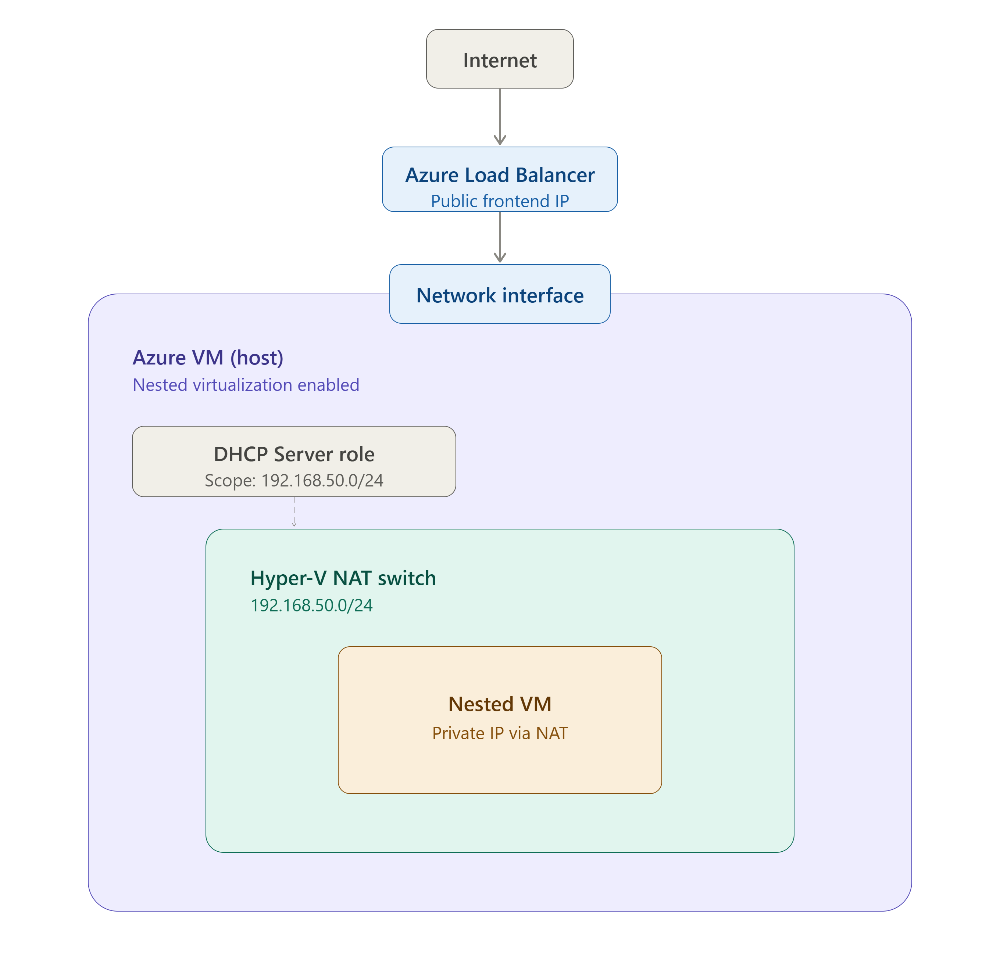
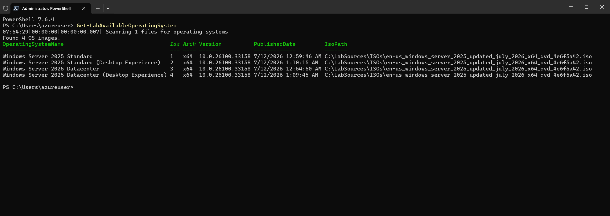
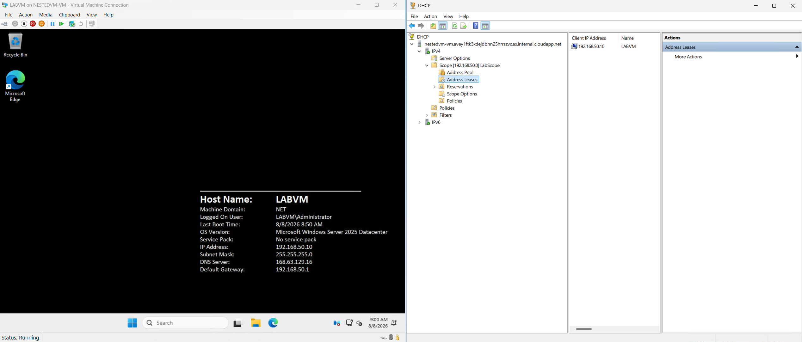

Series Table of contents:

- [Part 1: Infrastructure planning]()
- [Part 2: Prepare GitHub]()
- [Part 3: GitHub Workflows]()
- [Part 4: Terraform Deployment]()
- [Part 5: Nested Virtualization]()

This is the sixth and final part of this series, where we will discuss the final steps to complete our nested virtual
machine setup in Azure. In this part, we will focus on configuring the nested VM, ensuring that it is properly set up
for our lab environment, and testing its functionality.

The final infrastructure picture will look like this:



So in this part, we'll cover:
- Install PowerShell 7
- Install Visual Studio Code
- Install the PowerShell extension for Visual Studio Code
- Installing Hyper-V
- Adding a Hyper-V Nat switch so the nested VM can access the internet
- Installing and configuring a DHCP Server role
- Installing AutomatedLab
- Downloading the OS ISOs
- Deploying a nested VM to the Hyper-V host using AutomatedLab

## Installing PowerShell 7
Because we're on Server 2025 we can use winget to install PowerShell 7. We'll use the following command to install PowerShell 7:

```powershell
winget install --id Microsoft.Powershell --source winget
```

## Installing Visual Studio Code

```powershell
winget install --id Microsoft.VisualStudioCode.Insiders --scope machine --silent --accept-package-agreements --accept-source-agreements
```

## Installing the PowerShell extension for Visual Studio Code

```powershell
code-insiders --install-extension ms-vscode.powershell
```

## Installing Hyper-V

We'll use the following PowerShell commands to install and configure Hyper-V:

```powershell
# Install the Hyper-V role and include management tools
Install-WindowsFeature -Name Hyper-V -IncludeManagementTools -Restart
```

## Creating a Hyper-V NAT Switch

To allow our nested VM to access the internet, we will create a NAT switch on our Hyper-V host. This will enable
the nested VM to communicate with external networks while still being isolated within our lab environment.

We'll use the following PowerShell commands to create the NAT switch:

```powershell
# Create a new internal virtual switch for the nested VM
New-VMSwitch -Name "LabNATSwitch" -SwitchType Internal

# Retrieve the InterfaceAlias of the newly created virtual switch
$Interface = Get-NetAdapter | Where-Object {$_.Name -like "*LabNATSwitch*"}

# Configure the IP address for the virtual switch interface
New-NetIPAddress -IPAddress 192.168.50.1 -PrefixLength 24 -InterfaceAlias "$($Interface.Name)"

# Create a NAT network for the virtual switch
New-NetNat -Name "LabNAT" -InternalIPInterfaceAddressPrefix 192.168.50.0/24
```

## Installing and Configuring a DHCP Server Role

To make our lab environment more dynamic, we will install a DHCP Server role on our Hyper-V host. This will allow
the nested VM to receive an IP address automatically, making it easier to manage and connect to the nested VM without
having to manually configure network settings.

We'll use the following PowerShell commands to install the DHCP Server role:

```powershell
# Install the DHCP Server role and include management tools
Install-WindowsFeature -Name DHCP -IncludeManagementTools

# Add the DHCP Server scope and configure the gateway and DNS settings
# for the gateway, we will use the IP address of the Hyper-V NAT switch (192.168.50.1)
# for the DNS, we will use the well known Azure DNS server (168.63.129.16)
$splat = @{
    Name         = "LabScope"
    StartRange   = "192.168.50.10"
    EndRange     = "192.168.50.220"
    SubnetMask   = "255.255.255.0"
}
Add-DhcpServerv4Scope @splat

$splat = @{
    ScopeId      = "192.168.50.0"
    Router       = "192.168.50.1"
    DnsServer    = "168.63.129.16"
}
Set-DhcpServerv4OptionValue @splat

# For safety, restart the DHCP Server service
Restart-Service -Name DHCPServer
```

## Installing AutomatedLab

To simplify the deployment of our nested virtual machines, we will install AutomatedLab on our Hyper-V host.
AutomatedLab is a powerful tool that allows us to automate the creation and configuration of lab environments,
making it easier to manage and deploy nested VMs.

```powershell
# Install PSFramework.Nuget
$splat = @{
  Uri = 'https://raw.githubusercontent.com/PowershellFrameworkCollective/PSFramework.NuGet/refs/heads/master/bootstrap.ps1'
  UseBasicParsing = $true
}
Invoke-WebRequest @splat | Invoke-Expression

# Install AutomatedLab and Pester
Install-PSFModule -Name Pester -Repository PSGallery -TrustRepository -Scope AllUsers
Install-PSFModule -Name AutomatedLab -Repository PSGallery -TrustRepository -Scope AllUsers

# Pre-configure telemetry
# Disable (which is already the default) and in addition skip dialog
[Environment]::SetEnvironmentVariable('AUTOMATEDLAB_TELEMETRY_OPTIN', 'false', 'Machine')
$env:AUTOMATEDLAB_TELEMETRY_OPTIN = 'false'

# Pre-configure Lab Host Remoting
Enable-LabHostRemoting -Force

# Windows
New-LabSourcesFolder
```

## Downloading the OS ISOs

Downloading the OS ISOs from the Microsoft Eval Center or if you have an MSDN subscription, you can download them from there.
For this lab, we will be using Windows Server 2025.

Please make sure to download the ISO into E:\LabSources\ISOs folder. To make sure that AutomatedLab can find the OS variants
inside the ISO, we will run `Get-LabAvailableOperatingSystem`



## Deploying a Nested VM to the Hyper-V Host Using AutomatedLab

The lab script for creating the nested VM is:

```powershell
$LabName = 'NestedVMLab'

# Create a new lab definition
New-LabDefinition -Name $LabName -DefaultVirtualizationEngine HyperV

$PSDefaultParameterValues = @{
    'Add-LabMachineDefinition:Network'         = 'LabNATSwitch'
    'Add-LabMachineDefinition:ToolsPath'       = "$labSources\Tools"
    'Add-LabMachineDefinition:OperatingSystem' = 'Windows Server 2025 Datacenter (Desktop Experience)'
    'Add-LabMachineDefinition:Memory'          = 4GB
}

# Configure the lab network
$splat = @{
    Name             = 'LabNATSwitch'
    HyperVProperties = @{ SwitchType = 'Internal'; AdapterName = 'vEthernet (LabNATSwitch)' }
    AddressSpace     = '192.168.50.0/24'
}
Add-LabVirtualNetworkDefinition @splat

$splat = @{
    VirtualSwitch = 'LabNATSwitch'
    UseDhcp       = $true
}
$netAdapter = New-LabNetworkAdapterDefinition @splat

$splat = @{
    Name           = 'LABVM'
    Processors     = 2
    NetworkAdapter = $netAdapter
}
Add-LabMachineDefinition @splat

# Deploy the lab
Install-Lab

# Show the lab summary
Show-LabDeploymentSummary
```

To prove that the nested VM is working and also retrieves a dhcp address from the DHCP server.




That's it! You have successfully set up a nested virtual machine in Azure using Hyper-V and AutomatedLab.
You can now use this environment for testing, development, or learning purposes. Thank you for following along with this
series, and I hope you found it helpful. If you have any questions or feedback, feel free to reach out or leave a comment below.
