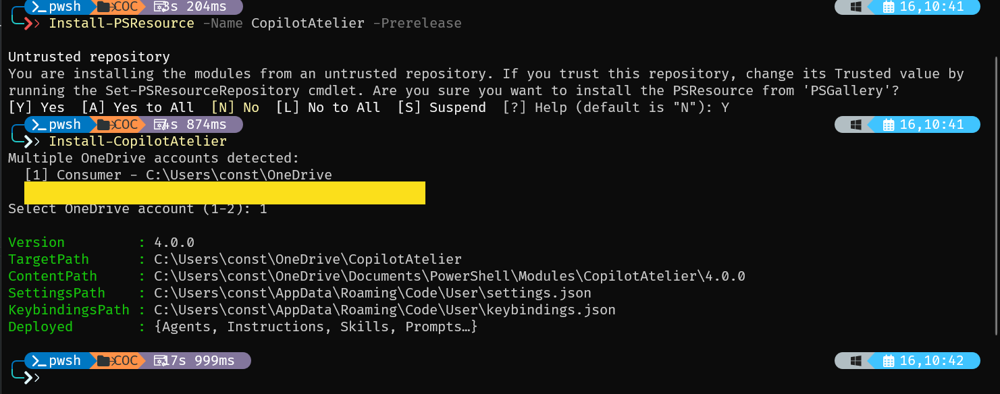
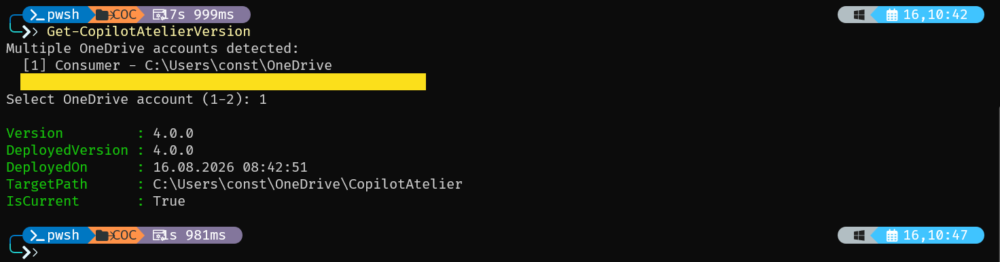

If you use GitHub Copilot Chat in VS Code and also the GitHub Copilot CLI, you've probably hit this problem:
custom agents, instructions, and skills all live under %USERPROFILE%\.copilot\, and they stay local to whatever machine
you built them on. Set up a second laptop, and you start from zero — no agents, no instructions, no skills.

[CopilotAtelier](https://github.com/raandree/CopilotAtelier) by Raimund Andrée is a PowerShell module that solves
exactly this. It keeps a canonical copy of your Copilot customizations in one synced location and wires the well-known
discovery folders to it with NTFS junctions.

## The Core Idea

Both the VS Code Copilot Chat extension and the GitHub Copilot CLI look for custom content in the same ~/.copilot/*
folders, but they don't share storage across machines on their own. CopilotAtelier's approach:

1. Store the canonical files in ~/OneDrive/CopilotAtelier/ (preferred, so OneDrive handles the cross-machine sync) or
   ~/CopilotAtelier/ as a fallback if OneDrive isn't installed.

2. Create NTFS junctions (symlinks on macOS/Linux) from ~/.copilot/{agents,instructions,skills,prompts,hooks}
   pointing at that canonical folder.

3. Write an agent, instruction, skill, or hook once, and both VS Code and the Copilot CLI see it immediately
   — on every machine that syncs the OneDrive folder.

Notably, for agents, instructions, and skills, no chat.*FilesLocations settings need to be written at all, because both
clients already auto-discover the well-known ~/.copilot paths. Prompts are the one exception — VS Code's Copilot Chat
only reads prompts from %APPDATA%\Code\User\prompts or paths explicitly listed in chat.promptFilesLocations, so the
setup script adds a single entry for that.

## What You Get

The repository organizes customizations into five folders, each mapping to a distinct Copilot Chat feature:

| Folder       | File Type             | Purpose                                                              |
| ------------ | --------------------- | -------------------------------------------------------------------- |
| Agents       | `*.agent.md`          | Custom AI personas with their own tools and instructions             |
| Instructions | `*.instructions.md`   | Coding standards that auto-apply via a glob or get attached manually |
| Skills       | `<name>/SKILL.md`     | On-demand capabilities exposed as slash commands                     |
| Prompts      | `*.prompt.md`         | Reusable templates for repeatable tasks                              |
| Hooks        | JSON config + scripts | Guardrails enforced at fixed points in the agent loop                |

The Skills library alone is extensive — dozens of skills covering PowerShell/DSC workflows
(Pester patterns, Sampler builds, DSC troubleshooting), Windows infrastructure
(WinRM diagnostics, MECM/SCCM deployment via DSC), document conversion (DOCX/XLSX/PDF to Markdown without external tools),
Outlook automation via COM, and even meta-skills like citation-integrity and devils-advocate-review for keeping
AI-generated output honest.

## Installation

You install the module from the PowerShell Gallery:

```powershell
Install-PSResource -Name CopilotAtelier -Prerelease
```

After installation, run the setup script to create the canonical folder and the junctions:

```powershell
Install-CopilotAtelier
```



That's the entire setup — no elevation required. Restart VS Code and the agents, skills, and prompts show up under
the Chat agent dropdown and / menu.

Keeping all the tools up to date is easy — just run the update script:

```powershell
Update-CopilotAtelier
```

If you want to check the current installed version, run:

```powershell
Get-CopilotAtelierVersion
```



## Syncing Across Machines
For a second machine, note that syncing the OneDrive folder isn't enough by itself — you still need to run
`Install-CopilotAtelier` there once to create the local ~/.copilot junctions and patch VS Code's settings.

There's also a third path: the repo publishes plugin.json, so it installs directly as an agent plugin via Chat:
Install Plugin From Source in VS Code, pointed at the repo URL. That gives you agents and skills
(exposed as /copilot-atelier:<skill>) with automatic updates, but not instructions or hooks — those still require
the Gallery module.

## Why It Matters

The interesting part isn't the junction trick itself — it's treating Copilot customization as something worth versioning,
syncing, and shipping as a proper module with update tooling, rather than a folder you manually copy between machines
and forget to keep current. If you're maintaining a non-trivial set of custom agents, instructions, or skills for
GitHub Copilot and work across more than one machine, CopilotAtelier is worth a look.

If you want to watch the latest UserGroup meeting where Raimund Andrée demos CopilotAtelier and more, check out the recording on YouTube:

[{: width="640" }](https://www.youtube.com/watch?v=o4KqeqtryfI){:target="_blank" rel="noopener noreferrer"}
