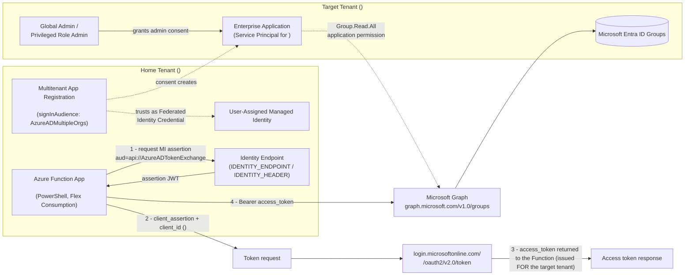
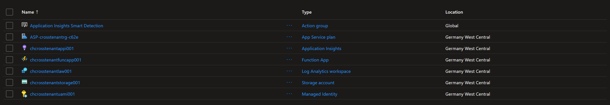
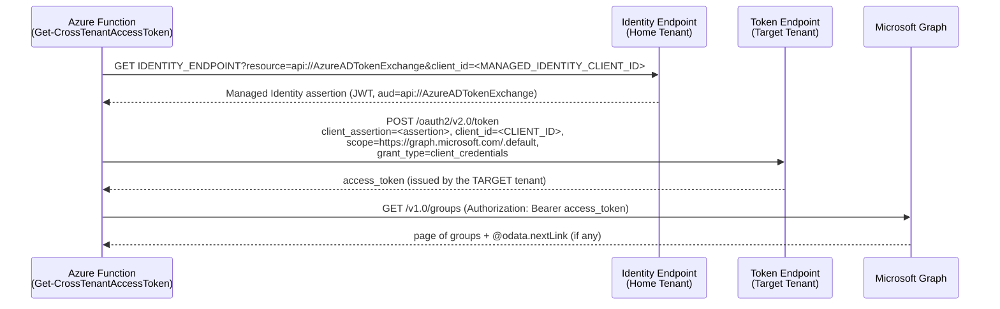
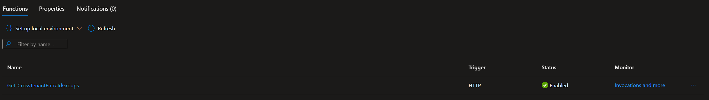

Multitenant SaaS and managed-service scenarios frequently need to read data from a customer's Microsoft Entra ID tenant, without ever storing a client secret or certificate for that customer. This article walks through a complete, working implementation of that pattern: an Azure Function, running under a User-Assigned Managed Identity, that exchanges its own identity token for a Microsoft Graph access token in a **different** tenant, using a multitenant App Registration and a Federated Identity Credential (FIC). The source code is available in the [AzureCrossTenantManagedIdentity](https://github.com/constantinhager/AzureCrossTenantManagedIdentity){:target="_blank"} GitHub repository.

## Scenario

A common requirement for managed service providers, and internal platform teams is: *"Our automation runs in our own Azure subscription, but it needs to read directory data (for example, security groups) from a customer's Microsoft Entra ID tenant."*

The traditional answers all have a downside:

- **Client secret per customer** - secrets expire, get leaked, and must be rotated and stored (usually in a Key Vault per customer), multiplying operational overhead as the customer count grows.
- **Certificate per customer** - better than a secret, but still a credential that must be generated, distributed, renewed, and revoked.
- **Delegated (user) permissions** - requires an interactive user in the customer tenant, which does not work for unattended background jobs.

What is actually needed is a way for the automation to prove *"I am the well-known service that the customer already trusted,"* without holding any customer-specific secret material at all.

## Solution Overview

Microsoft Entra ID supports configuring a **Federated Identity Credential (FIC)** on an App Registration so that the trusted "subject" issuing tokens is not a certificate or secret, but another Microsoft Entra ID identity - including a **User-Assigned Managed Identity (UAMI)**. Combined with a **multitenant App Registration** (`AzureADMultipleOrgs`), this produces the following flow:

1. An Azure Function App has a UAMI attached (home tenant).
2. A multitenant App Registration in the home tenant trusts that UAMI as a Federated Identity Credential.
3. The customer (target tenant) administrator grants admin consent to the multitenant application, which creates an Enterprise Application (Service Principal) for it in their tenant.
4. At runtime, the Function requests a token for the UAMI itself (audience `api://AzureADTokenExchange`), and uses that token as a **client assertion** to request a Microsoft Graph access token from the **target tenant's** token endpoint, using the multitenant application's Client ID.
5. The resulting access token is scoped to the target tenant and is used to call Microsoft Graph and read that tenant's groups.

No client secret or certificate is created, stored, or rotated at any point in this flow.

## Architecture Overview



Two identities matter here, and it is easy to conflate them:

- The **UAMI** is only ever used to obtain an assertion token in the home tenant. It never authenticates against the target tenant directly.
- The **multitenant App Registration's Client ID** is what is actually sent to the target tenant's token endpoint - the target tenant only ever sees this application, not the Managed Identity.

## Prerequisites

Before starting, the following is required:

- An Azure subscription in the **home tenant**, with rights to create Resource Groups, Storage Accounts, Managed Identities, and Function Apps.
- Global Administrator (or Privileged Role Administrator) rights in the **home tenant**, to create the App Registration and its Federated Identity Credential.
- A contact with Global Administrator (or Privileged Role Administrator) rights in the **target tenant**, to grant admin consent.
- PowerShell 7+ with the `Az` (or `Az` + `PSFramework.NuGet`) and `Microsoft.Graph.Applications` / `Microsoft.Graph.Identity.SignIns` modules.
- (Optional, for CI/CD) The GitHub CLI (`gh`) and a GitHub repository with Actions enabled.

## Tenant and Identity Model

| Identity                                                     | Lives in                              | Purpose                                                                                                                                                     |
| ------------------------------------------------------------ | ------------------------------------- | ----------------------------------------------------------------------------------------------------------------------------------------------------------- |
| User-Assigned Managed Identity (`<MANAGED_IDENTITY_NAME>`)   | Home tenant                           | Attached to the Function App; proves the Function's own identity to obtain the assertion token. Never used for anything else.                               |
| Multitenant App Registration (`<CLIENT_ID>`)                 | Home tenant (App Registration object) | The application identity actually presented to the target tenant. Configured with `signInAudience = AzureADMultipleOrgs`.                                   |
| Enterprise Application / Service Principal for `<CLIENT_ID>` | Target tenant                         | Created automatically when the target tenant's admin grants consent. This is what Microsoft Graph checks permissions against when the access token is used. |
| GitHub Actions deployment identity (`<DEPLOY_CLIENT_ID>`)    | Home tenant                           | Separate, single-tenant App Registration used only to deploy the Function App code via OIDC - unrelated to the runtime cross-tenant flow.                   |

The key architectural point: **the App Registration and the Managed Identity live in the same (home) tenant.** Only the resulting access *token request* crosses into the target tenant - the trust relationship (the FIC) never leaves the home tenant.

## Azure Resources

First, [`Scripts/0-New-CrossTenantAzureResources.ps1`](https://github.com/constantinhager/AzureCrossTenantManagedIdentity/blob/main/Scripts/0-New-CrossTenantAzureResources.ps1){:target="_blank"} provisions the following resources:

- **Resource providers** - registers Microsoft.Storage, Microsoft.Web, Microsoft.ManagedIdentity, Microsoft.OperationalInsights, and Microsoft.Insights if they are not already registered, waiting (up to 5 minutes) for each to reach the Registered state.
- **Resource Group** - the container for everything else.
- **User-Assigned Managed Identity** - the runtime identity of the Function App. Its Object (Principal) ID (needed as the FIC subject in script 1) and its Client ID (needed as a Function App setting) are printed explicitly.
- **Storage Account** - the Standard_LRS / StorageV2 account every Function App requires.
- **Log Analytics Workspace + workspace-based Application Insights** - the monitoring backend for the Function App's invocation logs and traces.
- **Function App** - PowerShell runtime on the Flex Consumption plan, with the UAMI attached.
- **App settings** - writes MANAGED_IDENTITY_CLIENT_ID (so the function code knows which identity to request a token for) and APPLICATIONINSIGHTS_CONNECTION_STRING (which the Functions runtime picks up automatically for logging).

After the deployment is the resource group should look like this in the Azure portal:



## Application Registration Configuration

The App Registration is created by [`Scripts/1-New-CrossTenantFederatedApp.ps1`](https://github.com/constantinhager/AzureCrossTenantManagedIdentity/blob/main/Scripts/1-New-CrossTenantFederatedApp.ps1){:target="_blank"}.

Where script 0 handled the Azure resource side, script 1 handles the Microsoft Entra ID identity side. It runs once in the home tenant and establishes the trust relationship that makes the whole cross-tenant flow possible - without ever creating a client secret or certificate.

It requires the Managed Identity's Object (Principal) ID from script 0.

The following steps are performed:

1. Connects to Microsoft Graph with the Application.ReadWrite.All scope in the home tenant.

2. Creates (or reuses) the multitenant App Registration with SignInAudience = 'AzureADMultipleOrgs' - this is what allows any tenant's administrator to consent to the application, without it having to be pre-registered in each target tenant. It also registers a placeholder Reply URL (https://portal.azure.com), which the admin-consent flow in step 4 needs to redirect back to. On reuse, the script re-fetches the app by ID and patches the Reply URL if it is missing or outdated.

3. Sets the Microsoft Graph application permissions. It looks up each requested permission (default Group.Read.All) in Microsoft Graph's own service principal, filtering for app roles where AllowedMemberTypes contains Application, and writes them to RequiredResourceAccess with Type = 'Role'. The distinction matters: 'Role' means an application permission (acts as itself, admin consent required), whereas 'Scope' would mean a delegated permission requiring a signed-in user - which would not work for an unattended Function.

4. Creates the Federated Identity Credential. This is the heart of the pattern:
Issuer = the home tenant's own STS (https://login.microsoftonline.com/<HomeTenantId>/v2.0)
Subject = the Object (Principal) ID of the User-Assigned Managed Identity
Audiences = api://AzureADTokenExchange
Any token the Managed Identity requests for that audience can now be presented as a client assertion for this App Registration - replacing what would otherwise be a client secret.

5. Prints the admin-consent URL for the target tenant. Because the app is multitenant, the /organizations/adminconsent endpoint is used, so the same URL works for any customer tenant.

The key architectural point is: the App Registration and the Managed Identity both live in the home tenant. Only the resulting token request crosses into the target tenant, where the consented Enterprise Application (Service Principal) is what Microsoft Graph evaluates permissions against.

You can use the output of script 0 to call script 1.


## Creating the Enterprise Application

Unlike a single-tenant app, there is nothing to run in the target tenant to "create" the Enterprise Application manually. The **Enterprise Application (Service Principal) is created automatically** the moment an administrator in the target tenant completes the admin consent flow for the application's Client ID. The script prints the exact consent URL to send to that administrator:

The output of script 1 will print you the the URL to send to the target tenant's Global Administrator or Privileged Role Administrator.

>Using the `/organizations/` admin-consent endpoint (instead of a tenant-specific one) allows the same URL to be reused for any customer tenant, since the sign-in audience is multitenant.
{: .prompt-info}

## Granting Permissions and Admin Consent

Because `Group.Read.All` is requested as an **application permission**, not a delegated one, only a Global Administrator or Privileged Role Administrator in the target tenant can grant it - a regular user cannot consent to application permissions, even for themselves.

Important distinction:

|                           | Application permissions | Delegated permissions                                |
| ------------------------- | ----------------------- | ---------------------------------------------------- |
| Acts as                   | The application itself  | A signed-in user                                     |
| Consent required from     | Tenant administrator    | User (or admin, for high-privilege scopes)           |
| Used here?                | Yes (`Group.Read.All`)  | No                                                   |
| Works for unattended jobs | Yes                     | No (needs an interactive/refresh-token user context) |

Once the target tenant admin opens the consent URL and approves it:

1. An Enterprise Application (Service Principal) for the App Registration is created in the target tenant.
2. The requested application permission (`Group.Read.All`) is granted and consented in that tenant.
3. Microsoft Graph will now authorize access tokens issued to this Client ID, scoped to that tenant, for the consented permission.

No credential exchange happens during this step - it is a pure authorization/consent operation.

## Azure Function Implementation

The Function App is a PowerShell Azure Functions app (Flex Consumption plan), scaffolded from the official [PSModuleDevelopment](https://psframework.org/docs/PSModuleDevelopment/overview/){:target="_blank"} `AzureFunction` template ([`Scripts/2-New-PSMDTemplate.ps1`](https://github.com/constantinhager/AzureCrossTenantManagedIdentity/blob/main/Scripts/2-New-PSMDTemplate.ps1){:target="_blank"}). Any `.ps1` file with a PowerShell function placed under `functions/httpTrigger` is automatically turned into an HTTP-triggered endpoint by the build process - no manual `function.json` authoring is required for new endpoints.

Two functions implement the actual cross-tenant logic:

- [`Get-CrossTenantAccessToken`](https://github.com/constantinhager/AzureCrossTenantManagedIdentity/blob/main/AzureFunctionApp/CrossTenantFunctionApp/CrossTenantFunctionApp/functions/nonPublished/Get-CrossTenantAccessToken.ps1){:target="_blank"} - performs the two-step token exchange and returns a raw access token. It lives under `functions/nonPublished`, **not** `functions/httpTrigger` - it is only ever called internally by the function below and is never published as its own HTTP endpoint.
- [`Get-CrossTenantEntraIdGroups`](https://github.com/constantinhager/AzureCrossTenantManagedIdentity/blob/main/AzureFunctionApp/CrossTenantFunctionApp/CrossTenantFunctionApp/functions/httpTrigger/Get-CrossTenantEntraIdGroups.ps1){:target="_blank"} - calls the function above, then pages through Microsoft Graph's `groups` endpoint. This is the only function under `functions/httpTrigger`, and therefore the only one exposed as a public HTTP endpoint.

Get-CrossTenantAccessToken does not need to be an HTTP trigger because it is only ever called internally by Get-CrossTenantEntraIdGroups. That's why it is placed under `functions/nonPublished` - it is not meant to be called directly from outside the Function App.

`MANAGED_IDENTITY_CLIENT_ID` is what tells the code *which* of the Function App's identities to use when more than the system-assigned identity could be present - it must be the Managed Identity's **Client ID**, not its Object ID. `APPLICATIONINSIGHTS_CONNECTION_STRING` is recognized automatically by the Azure Functions PowerShell runtime - no `host.json` change is required for invocation logs, traces, and requests to start flowing into Application Insights.

## Authentication Flow



The implementation, exactly as it exists in [`Get-CrossTenantAccessToken.ps1`](https://github.com/constantinhager/AzureCrossTenantManagedIdentity/blob/main/AzureFunctionApp/CrossTenantFunctionApp/CrossTenantFunctionApp/functions/nonPublished/Get-CrossTenantAccessToken.ps1){:target="_blank"}:

Why the **tenant-specific** token endpoint matters in step 2: using `/oauth2/v2.0/token` under the **target** tenant's ID (not `/organizations/` or `/common/`) is what tells Microsoft Entra ID *which* tenant should issue the access token and evaluate the application's consent status. If the home tenant ID were used instead, the request would fail, because the target tenant is the one that holds the Enterprise Application and its consented permissions.

## CI/CD Deployment (GitHub Actions)

Before the GitHub Actions workflow can deploy the Function App, a separate identity must be created for the deployment pipeline in your tenant. This is done by [`3-New-GitHubActionsFederatedApp.ps1`](https://github.com/constantinhager/AzureCrossTenantManagedIdentity/blob/main/Scripts/3-New-GitHubActionsFederatedApp.ps1){:target="_blank"}.

This script is independent of the cross-tenant Graph flow (scripts 0–1). It creates a separate identity - used only by GitHub Actions to deploy the Function App code to Azure - so a compromise of the deployment pipeline can never touch the runtime cross-tenant trust, and vice versa.

The following steps are performed:

1. Connects to Microsoft Graph with Application.ReadWrite.All.

2. Creates (or reuses) a single-tenant App Registration (SignInAudience = 'AzureADMyOrg', default name CHGitHubActionsDeployApp). Single-tenant because this identity only ever needs to authenticate against your own home tenant's Azure resources, unlike the multitenant runtime app.

3. Creates (or reuses) the corresponding Service Principal required as the target of the Azure RBAC role assignment in step 5.

4. Resolves the GitHub owner/repository numeric IDs. Since July 15, 2026, GitHub uses an immutable sub claim format (repo:OWNER@OWNER-ID/REPO@REPO-ID:ref:refs/heads/BRANCH) for new/renamed/transferred repos instead of the classic repo:OWNER/REPO:ref:.... The script calls the public GitHub REST API (https://api.github.com/repos/<org>/<repo>) to fetch these IDs automatically, unless -GitHubOwnerId/-GitHubRepositoryId are supplied explicitly.

5. Creates the Federated Identity Credential trusting GitHub's OIDC issuer (https://token.actions.githubusercontent.com) for that exact subject - no client secret is ever stored as a GitHub secret. If a credential with the same name already exists but its Subject has drifted (e.g. after a repo rename, or after GitHub's immutable-format rollout), the script updates it instead of silently skipping it.

6. Assigns an Azure RBAC role (default Website Contributor) to the Service Principal, scoped to the Function App's Resource Group - the minimum needed to publish the app.

7. Prints the GitHub secrets to configure (AZURE_CLIENT_ID, AZURE_TENANT_ID, AZURE_SUBSCRIPTION_ID) plus the exact federated-credential subject, for verification.

After the deployment identity is created, we can check out the workflow file in the repository.

[`.github/workflows/deploy-function.yml`](https://github.com/constantinhager/AzureCrossTenantManagedIdentity/blob/main/.github/workflows/deploy-function.yml){:target="_blank"} builds and publishes the Function App on every push to `main` that touches `AzureFunctionApp/CrossTenantFunctionApp/**`, or on manual `workflow_dispatch`. It authenticates to Azure using **OIDC** - no Azure client secret is stored in GitHub at all - and then runs `build/psf-build.ps1 -AppRg ... -AppName ... -Restart`.

After the deployment of the GitHub action succeeded you can see a function inside of the Azure Function in the portal.



## Retrieving Groups from Microsoft Graph

A sample request to the Function App looks like this:

```PowerShell
$Params = @{
    Uri    = 'https://<your-function-app-name>.azurewebsites.net/api/Get-CrossTenantEntraIdGroups?TenantId=target-tenant-id&ClientId=client-id-of-application&code=your-function-key-here'
    Method = 'GET'
}
$AllGroups = Invoke-RestMethod @Params
$AllGroups.DisplayName
```

That's it for this blog post.
