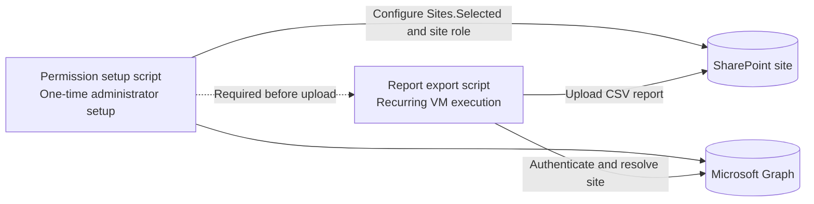
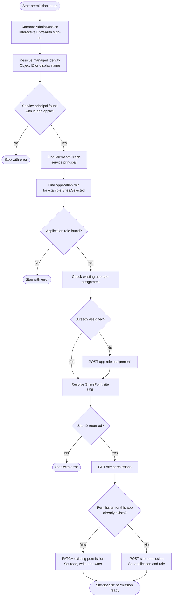
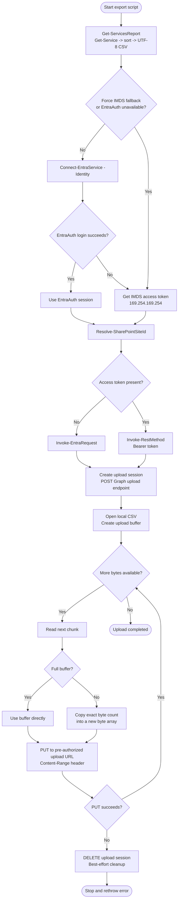
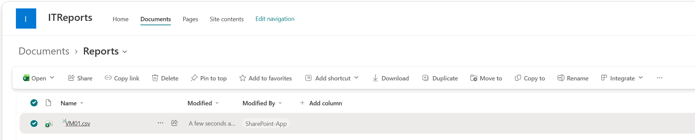

## Scenario
I had the need to upload some service reports from a virtual machine (VM) to SharePoint. I wanted to do this securely, without embedding credentials in my code. Storing a client secret or certificate on the VM felt like an unnecessary risk, especially since the reports needed to be uploaded on a recurring schedule. A Managed Identity solves this nicely because Azure handles the credential lifecycle for me, so there is nothing to store, rotate, or accidentally leak. It also keeps the setup auditable, since access to the SharePoint site is explicitly granted to the identity rather than a shared service account.

## Solution Overview
So I decided to use a **Managed Identity** for the VM, which allows it to authenticate to the appropriate SharePoint site without needing to manage credentials. Since a Managed Identity has no access to SharePoint by default, I used the [`Sites.Selected`](https://learn.microsoft.com/en-us/sharepoint/dev/solution-guidance/security-apponly-azuread#restrict-an-azure-ad-app-to-a-specific-sharepoint-site){:target="_blank"} Microsoft Graph permission to grant it access to only the single site it needs, rather than every site in the tenant. This follows the principle of least privilege and limits the blast radius if the VM is ever compromised. The whole solution splits neatly into a one-time setup step performed by an administrator and a recurring runtime step that runs unattended on the VM.

The upload logic itself is not tied to service reports - it accepts any local file path and target path, so the same script can ship logs, backups, or any other recurring export to SharePoint.

The full source code for both scripts is available in the [BlogAssets](https://github.com/constantinhager/BlogAssets/tree/main/Uploading%20VM%20Service%20Reports%20to%20SharePoint%20with%20a%20Managed%20Identity){:target="_blank"} GitHub repository.

## Architecture



## Prerequisites
- A virtual machine in Azure with a user or system-assigned **Managed Identity** enabled.
- A SharePoint site where the reports will be uploaded.
- The PowerShell module [EntraAuth](https://github.com/FriedrichWeinmann/EntraAuth) by [Friedrich Weinmann](https://github.com/FriedrichWeinmann) installed on the VM.
- An administrator account with the Microsoft Graph delegated permissions `Application.Read.All` and `AppRoleAssignment.ReadWrite.All` (or an equivalent admin role) to run the one-time permission setup script.

## Configure the SharePoint Site permission

First, I created a PowerShell script called [`Set-SharePointPermissionForManagedIdentity.ps1`](https://github.com/constantinhager/BlogAssets/blob/main/Uploading%20VM%20Service%20Reports%20to%20SharePoint%20with%20a%20Managed%20Identity/Set-SharePointPermissionForManagedIdentity.ps1){:target="_blank"} that sets up the necessary permissions for the Managed Identity. This script is run once by an administrator and configures the SharePoint site to allow access via Microsoft Graph.

The script is idempotent: it checks whether the `Sites.Selected` app role is already assigned to the Managed Identity's service principal before granting it, and whether a site-specific permission already exists before creating one. If a permission already exists, it is updated in place (`PATCH`) rather than duplicated, so the script can safely be re-run to change the assigned role (read, write, or owner) or to verify the current setup.



An example of running the script is shown below.

```powershell
$Param = @{
    TenantId                   = 'yourtenant.onmicrosoft.com'
    SiteUrl                    = 'https://yourtenant.sharepoint.com/sites/yoursite'
    ManagedIdentityDisplayName = 'your Vm Name'
    Verbose                    = $true
}
.\Set-SharePointPermissionForManagedIdentity.ps1 @Param
```


## Uploading the Service Report

Next, I created a second PowerShell script called [`Export-ServicesToSharePoint.ps1`](https://github.com/constantinhager/BlogAssets/blob/main/Uploading%20VM%20Service%20Reports%20to%20SharePoint%20with%20a%20Managed%20Identity/Export-ServicesToSharePoint.ps1){:target="_blank"} that runs on the VM. This script uses the Managed Identity to authenticate to Microsoft Graph, resolve the SharePoint site, and upload any file (in this example, the service report in CSV format).





An example of running the script is shown below.

```powershell
$Param = @{
    SiteUrl       = 'https://yourtenant.sharepoint.com/sites/yoursite'
    LocalFilePath = 'C:\path\to\your\report.csv'
    TargetPath    = 'Reports/report.csv'
    Verbose       = $true
}
.\Export-ServicesToSharePoint.ps1 @Param
```

You can schedule this script to run on a recurring basis using Windows Task Scheduler or any other scheduling mechanism of your choice. The script will handle authentication and file upload automatically, ensuring that your service reports are consistently uploaded to SharePoint without the need for manual intervention or credential management.

If you view the SharePoint site after running the script, you should see the uploaded report in the specified target path.



That's it! No client secrets or certificates ever touch the VM, the Managed Identity only ever has access to the one SharePoint site it needs, and the same script can be reused for any other recurring file you want to land there.
